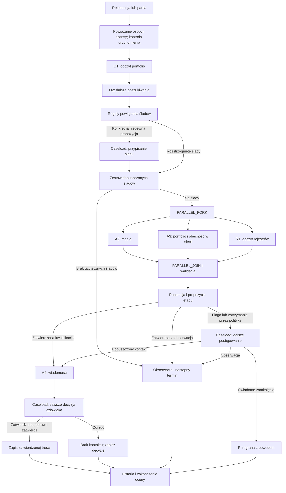

# Opiekun nowego fotografa — MVP „Ukryty potencjał”

Status: implementacja fazy 1 i weryfikacja projektu bez zmian frameworka. Dokument opisuje również planowane dalsze fazy; nie stanowi potwierdzenia gotowości pełnego MVP.

## 📝 TLDR

MVP pomaga operatorowi Crystal Albums wybrać fotografów, którzy zarejestrowali się w sklepie, ale nigdy nie zamówili, i przygotować dla nich pierwszy kontakt. Automatyzacje (`workflows`) prowadzą trwałe wykonanie procesu, a `agent_orchestrator` uruchamia agentów oraz obsługuje propozycje, decyzje w Caseload i ich historię. Agenci odkrywają i badają ślady fotografa oraz przygotowują wiadomość; punkty i reguły przejścia wylicza kod. Niska pewność konkretnej propozycji, potwierdzona flaga biznesowa i każda wiadomość wymagają decyzji człowieka.

## 📝 Overview

Jedna funkcjonalność: od rejestracji fotografa bez zamówień do obserwacji, decyzji o dalszym postępowaniu albo zatwierdzenia pierwszej wiadomości. Fotograf jest osobą w CRM, ma jedną szansę w lejku „Ukryty potencjał”, a kolejne oceny dopisują aktywności do tej szansy. Nie tworzymy nowej biznesowej encji oceny ani własnej kolejki decyzji.

Scenariusz weekendu obejmuje 100–200 rejestracji oraz demonstrację jednej nowej rejestracji. Istniejący [symulator rejestracji](../2026-09-19-photographer-registration-simulator.md) pozostaje źródłem danych. Jego API zapisuje oryginalne cztery pola i emituje `photographers.raw_data.created`; podłączenie procesu jest częścią tego MVP. Import partii korzysta z tego samego kontraktu i tej samej ścieżki oceny, bez nowego uniwersalnego importera.

Poza zakresem: automatyczna wysyłka, odbiór odpowiedzi, ponawianie wiadomości, migracja zamówień, produkcyjny harmonogram dla całej bazy, obsługa wielu marek oraz samodzielne strojenie reguł przez AI. MVP oblicza i pokazuje termin kolejnej oceny; na scenie nie odtwarzamy upływu 14–180 dni. Symulator jest osobną, istniejącą funkcjonalnością; nie przebudowujemy go w tej specyfikacji.

## 📝 Problem Statement

Rejestracja daje jedynie imię, nazwisko, e-mail i portfolio. Aby zdecydować o kontakcie, operator musi ustalić, kim jest fotograf, czym się zajmuje i czy istnieje uzasadnienie propozycji druku. Ręczne sprawdzanie każdej osoby nie skaluje się do zaległej bazy, a bez weryfikacji tożsamości łatwo przypisać informacje z działalności innego człowieka.

Wynikiem biznesowym jest pierwsze zamówienie. Docelowa miara to liczba fotografów i wartość ich pierwszych zamówień w ciągu 90 dni od rzeczywistego kontaktu. MVP nie tworzy dashboardu tej miary ani nie traktuje zatwierdzonego szkicu jako dowodu wysłania.

## 📝 Proposed Solution

### Uzgodnienia Q1 i Q2 — 2026-09-19

**Q1. Przypisanie działalności.** „Potwierdzony wpis” oznacza ustalenie, że konkretny wpis rejestrowy dotyczy fotografa zarejestrowanego w sklepie. Nie oznacza aktywnej działalności. Samo zgodne nazwisko i fotograficzne PKD nie wystarczają: nazwisko porównujemy z danymi fotografa, a PKD określa branżę, nie tożsamość.

Zaakceptowany przykład: portfolio wskazane przy rejestracji dostarcza imienia, nazwiska i miasta; wpis CEIDG zawiera te same dane i skorelowany adres e-mail. Zapisujemy porównane wartości oraz źródła, w tym podstawę powiązania e-maila. Pełny katalog dopuszczalnych kombinacji i reguł korelacji pozostaje do późniejszego dopracowania.

Dla MVP stosujemy zachowawczą, wersjonowaną regułę: automatyczne potwierdzenie tego przykładu wymaga zgodnych imienia, nazwiska i miasta, dokładnie tego samego adresu e-mail z rejestracji lub powiązanego portfolio i braku sprzeczności. Porównanie może usuwać zewnętrzne spacje i normalizować wielkość liter w domenie e-maila; nie usuwa kropek, aliasów `+` ani nie zgaduje podobnych adresów. Inne rodzaje korelacji wymagają przedstawienia konkretnego powiązania człowiekowi. Nie zakładamy, że każdy wpis CEIDG zawiera e-mail. Żadne rozszerzenie automatycznych reguł nie wynika z samej deklaracji pewności modelu.

**Q2. Powody decyzji człowieka.** Niska pewność konkretnej propozycji kieruje ją do ręcznej decyzji w Caseload. Flaga jest osobnym powodem zatrzymania: potwierdzona okoliczność biznesowa, np. zawieszona działalność, wymaga oceny człowieka nawet przy pewnej tożsamości i wysokiej punktacji. Brak danych nie jest flagą. Nie tworzymy biznesowej miary „pewności poprawnego zastosowania reguł”; poprawność kodu weryfikują testy. Punktów nie przeliczamy na pewność przez dzielenie przez 100.

Te ustalenia zastępują sprzeczne skróty w starszych dokumentach: nazwisko + PKD nie potwierdza tożsamości, a flaga nie musi sztucznie obniżać pewności ustalenia do zera. Wymusza decyzję człowieka przez regułę zatwierdzania.

### Potwierdzenie braku zamówień

Cztery pola rejestracji nie dowodzą, że fotograf nigdy nie zamówił. Przed oceną prawdziwej osoby operator sprawdza to w danych sklepu i zapisuje szyfrowane potwierdzenie `{status: no_orders_confirmed, checkedAt, confirmedBy, sourceRef, expiresAt}` powiązane z osobą i zakresem organizacji. `confirmedBy` pochodzi z uwierzytelnienia, nie z deklaracji klienta. Startowa ważność potwierdzenia dla demo wynosi 24 godziny; to parametr wdrożenia, nie twierdzenie o aktualności danych sklepu przez cały ten czas.

Partia zawiera wyłącznie sprawdzone osoby. Osoba użyta do nowej rejestracji na scenie jest sprawdzona przed pokazem, a jej potwierdzenie przypisane do CRM; zdarzenie symulatora odnajduje to powiązanie. Syntetyczne testy mają jawne `source=demo_fixture`. Brak lub wygaśnięcie potwierdzenia daje `eligibility_required`: zachowujemy rejestrację i nie uruchamiamy agentów. Nie interpretujemy braku lokalnego zamówienia w CRM jako dowodu braku zamówień w sklepie.

Przed zastosowaniem akcji kontaktowej komenda sprawdza ważność tego potwierdzenia i brak lokalnie odnotowanego pierwszego zamówienia/zamknięcia. Bez integracji zamówień nie wykryjemy samoczynnie zakupu w sklepie po sprawdzeniu — operator musi odnotować go ręcznie. Demo nie wysyła wiadomości; podłączenie bieżących zamówień jest wymaganiem późniejszej automatyzacji rzeczywistego kontaktu.

### Przebieg i rozstrzygnięcia

| Sytuacja | Zachowanie |
|---|---|
| Bezpośrednie, dostępne portfolio z rejestracji | Dopuszczone jako ślad wskazany przez fotografa; sprzeczność co do osoby wymaga wyjaśnienia. |
| Jeden konkretny kandydat i częściowe powiązanie | Propozycja przypisania → ręczna akceptacja; do tego czasu brak faktów z tego śladu. |
| Wielu nierozstrzygniętych kandydatów albo brak dopasowania | Zapis niepotwierdzonego śladu i kandydatów; bez losowego wyboru i bez pustego zadania dla człowieka. Pozostałe potwierdzone ślady można badać. |
| Niska lub brakująca pewność istniejącej propozycji | Caseload, wstrzymanie wykonania, jawny powód. |
| Potwierdzona flaga: zawieszenie, wykreślenie, niefotograficzne PKD | „Do weryfikacji”, zawsze Caseload, niezależnie od punktów i pewności. |
| Bez flag, kategoria produktowy i komercyjny | Obserwacja niezależnie od punktów. |
| Bez flag, pozostałe kategorie, wynik <60 | Propozycja obserwacji; automatyczne wykonanie tylko po przejściu polityki platformy. |
| Bez flag, pozostałe kategorie, wynik ≥60 | Propozycja kwalifikacji do kontaktu; po zatwierdzeniu przygotowanie wiadomości. |
| Gotowa wiadomość | „Do kontaktu”; każda treść wymaga człowieka, także przy wysokiej pewności. |

Flaga nie zamyka szansy. Operator może wybrać pozostawienie w obserwacji, dopuścić kontakt mimo flagi z uzasadnieniem albo świadomie zamknąć szansę jako przegraną. Dopuszczenie kontaktu jest wyjątkiem zapisanym dla tej oceny i tego zestawu faktów; nie usuwa flagi z historii ani nie zmienia reguł dla innych osób. Odrzucenie całej propozycji pomija jej akcje; nie oznacza wybrania opcji „przegrana”.

### Reguły punktowe

Każda spełniona reguła tworzy pozycję uzasadnienia z faktem, źródłem i liczbą punktów. Suma jest ograniczona do 100. `unknown` daje 0 i nigdy punktów ujemnych. Reguła dotycząca tego samego zjawiska nie nalicza się ponownie za kilka źródeł.

| Fakt | Punkty startowe |
|---|---:|
| NIP potwierdzony w przypisanym rejestrze | 20 |
| Działalność starsza niż dwa lata | 20 |
| VAT czynny | 15 |
| PKD fotograficzne | 5 |
| Pokazuje albumy, odbitki, oprawy lub wzmiankę o druku | 10 |
| Instagram: ostatni post <30 dni | 5 |
| Instagram: co najmniej 1000 obserwujących | 5 |
| Instagram: zaangażowanie co najmniej 3% | 5 |
| Facebook: ostatni post <30 dni | 5 |
| Własna domena | 5 |
| Aktualna strona | 5 |
| Kalendarz rezerwacji | 5 |
| Rozpoznany system galerii, inny niż brak/nieznane | 5 |
| Google Maps: co najmniej 20 opinii | 5 |
| Google Maps: ocena co najmniej 4,7 | 5 |

Kategoria pochodzi z badania portfolio: ślubny, rodzinny i noworodkowy, szkolny i przedszkolny, reportażowy i eventowy, produktowy i komercyjny, inny, nieznane. System galerii: Zalamo, Mafelo, Photonesto, Fotoklaser, Fotigo, Pixieset, Pic-Time, nPhoto, inny, brak; osobny stan `unknown` oznacza, że nie udało się ustalić faktu.

Zaangażowanie to średnia liczba polubień i komentarzy z ostatnich 12 dostępnych postów podzielona przez liczbę obserwujących; zapis zawiera liczbę przeanalizowanych postów. Przy mniej niż 12 postach wynik jest częściowy i reguła punktowa za zaangażowanie nie nalicza się. Zerowy mianownik lub brak dostępu daje `unknown`. Wzrost obserwujących przy pierwszej ocenie jest nieznany. Obliczenia używają jednej daty `evaluatedAt` zapisanej dla oceny, nie różnych odczytów zegara w kolejnych krokach.

### Porównanie z istniejącymi rozwiązaniami

n8n pozwala zatrzymać workflow przed wywołaniem wybranego narzędzia i pokazać człowiekowi dokładne argumenty akcji. Przyjmujemy przejrzystość konkretnej zatwierdzanej czynności, ale używamy Caseload i istniejących komend Open Mercato, bez dodatkowego kanału akceptacji. [Dokumentacja n8n](https://docs.n8n.io/build/integrate-ai/ai-examples/human-in-the-loop-for-tools).

LangGraph opisuje trwałe przerwania oraz fakt, że kod przed przerwaniem może wykonać się ponownie przy wznowieniu. Wniosek projektowy: każda mutacja i utworzenie propozycji muszą być odporne na powtórzenie; samo zapisanie stanu workflow nie zapewnia tego dla skutków ubocznych. Korzystamy z istniejącego silnika Open Mercato, bez dodawania LangGraph lub drugiej warstwy checkpointów. [Przerwania](https://docs.langchain.com/oss/javascript/langgraph/interrupts), [trwałość stanu](https://docs.langchain.com/oss/javascript/langgraph/persistence).

## 📝 Architecture

### Odpowiedzialności

| Element | Odpowiedzialność i miejsce |
|---|---|
| `photographers` | Logika Crystal Albums w `apps/mercato/src/modules/photographers/`: reguły, adaptery, definicja procesu, komendy i agenci. |
| `workflows` / Automatyzacje | Jedyny silnik wykonania: kroki, rozgałęzienia, parallel fork/join, oczekiwanie, ponowienia, anulowanie. Nazwa modułu i adresy pozostają `workflows`. |
| `agent_orchestrator` | `ProcessDefinition` wskazuje definicję workflow; `ProcessInstance` jest projekcją. Agenci, wyniki, propozycje, Caseload, ślady wykonania i poprawki. |
| `customers` | Osoby, jedna szansa na fotografa, lejek, aktywności, interakcje i pola własne. Bez firmowego rekordu CRM na potrzeby tego MVP. |
| `events`, `queue`, `progress` | Trwałe dostarczenie zdarzeń, praca poza żądaniem HTTP i wspólny postęp partii. |
| `web-research` przez narzędzia Orchestratora | Wyszukiwanie i odczyt źródeł z budżetami, ACL i zabezpieczeniami adresów. |

Integrację utrzymuje wyłącznie moduł aplikacyjny `photographers`. Zgodnie z decyzją użytkownika nie zmieniamy żadnego pliku frameworka ani nie dodajemy hosta w Caseload. Korzystamy z istniejących aktywności workflow, usług DI, kolejek, przechwytywania komend i miejsca `backend:layout:top` na widget aplikacji. Dostęp do opcjonalnych modułów przez DI i `tryResolve`/`try…catch`; brak Orchestratora lub workflow nie blokuje zapisu rejestracji. Uruchomienie oceny zwraca wtedy czytelny błąd niedostępności, a zachowane dane można przetworzyć po włączeniu zależności. Nie zmieniamy kodu domenowego `customers`, nie dokładamy zależności enterprise do core i nie tworzymy bezpośrednich relacji ORM między modułami.

### Definicja i wyzwalacze

Jedna wersjonowana definicja `photographers.hidden_potential`, powiązana z rzeczywistym `WorkflowDefinition`. Instalacja używa `workflowDefinitionAuthoring` przez DI i mechanizmu własności definicji. Aktualizacja tworzy nową wersję dla przyszłych ocen; aktywne wykonanie zachowuje swoją wersję oraz wersje reguł. Nie nadpisujemy definicji, którą operator przejął do ręcznej edycji.

Rejestracja emituje istniejące zdarzenie `photographers.raw_data.created`. Jeden trwały odbiorca modułu przygotowuje powiązanie fotografa i wywołuje komendę `agent_orchestrator.processes.startExecution` z kluczem idempotencji. Nie uruchamiamy równolegle drugiego bezpośredniego triggera workflow dla tego samego zdarzenia. Ręczna partia przechodzi tę samą komendę aplikacyjną, z kontekstem `source=batch`; proces deklaruje dozwolone uruchomienie ręczne. To komenda procesu i worker Orchestratora uruchamiają `workflowExecutor.startWorkflow`; nie wstawiamy `WorkflowInstance` bezpośrednio i nie używamy Playground jako API procesu.

Kontekst początkowy zawiera identyfikatory: `registrationId`, `photographerId`, `dealId`, `evaluationId`, `source`, `evaluatedAt`, `rulesVersion`. Zakres organizacji, tożsamość wykonawcza i uprawnienia pochodzą z zaufanego kontekstu. `evaluationId` to klucz korelacji, a nie nowa encja biznesowa. PII odczytywane jest w kroku wymagającym tych danych.

### Graf jednej oceny

Graf pokazuje logikę biznesową. Każda propozycja przechodzi pełną politykę platformy; strzałka „zatwierdzona” nie omija tej polityki. Odrzucenie propozycji dalszego postępowania kończy ocenę bez jej akcji i zachowuje aktualny etap z widoczną decyzją.

### Zadania i wyniki

| Krok | Wykonawca | Wejście → wynik |
|---|---|---|
| O1 | Agent OpenCode `photographers.portfolio_reader` | Surowe portfolio i dane osoby → rodzaj wpisu, odczyt portfolio, ślady z pochodzeniem. Nazwę konta sprawdza najpierw na Instagramie, potem na Facebooku. |
| O2 | Agent OpenCode `photographers.trace_finder` | Rejestracja i O1 → ślady ze strony/stopki, wyszukania e-maila i kandydatów rejestrowych. Brak wyniku O1 nie pomija O2. |
| K1 | Kod domenowy i adapter propozycji | Porównania ze źródłami → potwierdzone ślady lub konkretna propozycja do decyzji; niepotwierdzone pozostają poza badaniem. |
| A2 | Agent OpenCode `photographers.social_researcher` | Potwierdzone konta → liczby, daty, posty i informacja o druku. Wspólna funkcja liczy zaangażowanie i wzrost. |
| A3 | Agent OpenCode `photographers.portfolio_researcher` | Potwierdzone portfolio/strona/galeria/Maps → kategoria, aktualność, rezerwacje, system galerii, opinie. |
| R1 | Odczyt przez zarejestrowaną funkcję workflow | Potwierdzone identyfikatory rejestrowe → uporządkowane fakty o działalności, PKD i VAT. Nie wyszukuje ponownie tożsamości. |
| Scalenie | Kod domenowy | Osobne wyniki A2/A3/R1 → zwalidowany zestaw faktów i wskazane braki/sprzeczności. |
| Punktacja | Kod domenowy i adapter propozycji | Fakty i wersja reguł → punkty, pozycje uzasadnienia, flagi i dopuszczalne akcje. |
| A4 | Agent OpenCode `photographers.message_writer` | Zatwierdzona kwalifikacja, kategoria, galeria, dozwolone portfolio → pełny szkic; adapter tworzy propozycję jego akceptacji z `alwaysAsk: true`. |

Agenci O1/O2/A2/A3 oraz A4 zwracają `research`; po A4 adapter publikuje propozycję odnoszącą się do utrwalonej wiadomości. Ten podział chroni treść przed skopiowaniem do nieszyfrowanego workflow. Wyniki weryfikuje Zod i istniejące guardraile. Pliki `AGENT.md`, `OUTCOME.md`, `FACTS.json` i umiejętności leżą pod `photographers/agents/`; używają wspieranego podzbioru JSON Schema. Narzędzia są wyłącznie do odczytu, z najwęższym zakresem per rola. Narzędzia wyszukiwania to istniejące `agent_orchestrator.web_search` i `agent_orchestrator.web_fetch`, a nie swobodna sieć w skryptach OpenCode.

Każda gałąź zapisuje osobny wynik; agent nie modyfikuje wspólnego kontekstu workflow. Definicja jawnie mapuje wyłącznie bezpieczne odwołania przez `outputMapping`; wynik `EXECUTE_FUNCTION` znajduje się pod `result`. Surowy wynik agenta `data` pozostaje w warstwie Orchestratora i szyfrowanym materiale; nie jest mapowany do workflow. Scalenie czeka na wszystkie trzy gałęzie, również zakończone kontrolowaną niedostępnością. Nowy ślad znaleziony podczas badania wraca do potwierdzenia przed użyciem; w MVP może pozostać zapisany jako kandydat do następnej oceny, bez nieograniczonej pętli poszukiwań.

### Punktacja jako propozycja bez modelu językowego

`defineAgent` nie udostępnia obecnie zwykłego deterministycznego callbacku wykonania. Nie projektujemy fikcyjnego agenta, który miałby bez LLM działać przez ten kontrakt, ani nie powierzamy modelowi przepisywania i poprawiania punktów.

Moduł nie rejestruje własnych typów aktywności. Zlecenie zadania jest istniejącą aktywnością `EXECUTE_FUNCTION` umieszczoną na przejściu do standardowego kroku `WAIT_FOR_SIGNAL`. Funkcja z DI zapisuje zlecenie w kolejce platformy i zwraca tylko identyfikator operacji. Przejście zapisuje ten wynik w kontekście właściwej gałęzi przed wejściem w oczekiwanie. W odróżnieniu od aktywności wewnątrz kroku AUTOMATED ten punkt wywołania przekazuje również `branchInstanceId`.

Worker przed pracą sprawdza zatwierdzony zapis operacji, zakres, właściwą gałąź i aktywną próbę kroku oczekiwania. Wcześniejsze dostarczenie zadania kończy się ponowieniem, nie utratą wyniku. Każda gałąź i etap decyzji ma osobną nazwę sygnału. W wyniku wracają wyłącznie UUID i status, bez materiałów osobowych. Spóźniony callback nie może wznowić późniejszej próby. Testy używają rzeczywistych funkcji silnika, ale test z pamięciową bazą nie zastępuje próby transakcji i restartu prawdziwego workera.

Kod publikuje typowany wynik reguł istniejącymi komendami `agent_orchestrator.runs.create`, `agent_orchestrator.runs.complete` i `agent_orchestrator.proposals.create`, z rzeczywistym śladem obliczenia i walidacją guardrailami. Nie oznacza obliczenia jako odpowiedzi LLM ani nie fabrykuje zużycia tokenów. Politykę ocenia istniejący `dispositionService`. Worker tworzy propozycję dopiero po potwierdzeniu oczekiwania; decyzja człowieka nadal używa canonical dispose.

Nie polegamy na samym `stepId` w standardowym sygnale `agent_orchestrator.proposal.ready`: silnik nie sprawdza go jako korelacji próby. Moduł przekazuje utrwaloną decyzję przez własny trwały odbiornik i kolejkę, weryfikuje propozycję/operację/próbę, po czym wysyła dedykowany sygnał z bezpiecznymi odwołaniami. Natywne wznowienie dla tych propozycji musi być wyłączone wspieranym `skipResume` w przechwyceniu komendy, dopiero razem z gotowym własnym przekazaniem; nie wolno pozostawić procesu bez drogi wznowienia.

Dla jednoznacznego wyniku kodu wymagane pole techniczne `confidence` może wynosić 1, wyłącznie jako zgodność wynikowej propozycji z regułą i zwalidowanym snapshotem. Nie jest to prawdopodobieństwo zakupu ani nowy wskaźnik biznesowy. Niepewna tożsamość nie staje się pewna dzięki temu polu: wymaga człowieka. Flagi i wiadomość używają `alwaysAsk: true`. Brak śladu wykonania, błąd guardraila, polityka organizacji lub niedozwolona akcja nadal zatrzymują wykonanie, także przy `confidence=1`.

Adapter jest nowym kodem aplikacyjnym wymagającym testu od początku do końca w fazie 1. Rejestracja funkcji DI, workera i odbiornika nie może zmieniać globalnej polityki Orchestratora. Test musi objąć decyzję przychodzącą tuż przed zaparkowaniem, odtworzenie po restarcie, ponowną publikację oraz dokładnie jednokrotne zastosowanie skutku. Nie wolno zastępować brakującego połączenia bezpośrednią mutacją ani ręcznym ustawieniem statusu workflow.

### Reguły zatwierdzania

Propozycja zawiera `options[]`, uzasadnienie i konkretne dozwolone komendy. Operator zatwierdza wybraną opcję (`selectedOptionId`); wielowariantowa propozycja nie ma domyślnie wybranej opcji. Edycja dotyczy tylko wybranej opcji. Odrzucenie nie wykonuje żadnej z jej akcji.

Reguły punktowe, próg, limity i wersja są zapisane przez istniejący `ModuleConfigService` pod modułem `photographers` i kluczem `hidden_potential_rules`; dane konfiguracyjne nie zawierają PII. Ocena pobiera niezmienny snapshot tej konfiguracji na starcie. Próg pewności propozycji agenta jest konfiguracją procesu, odrębną od progu 60 punktów. Startowa konfiguracja dla propozycji dopuszczonych do automatyzacji: `autoApproveThreshold=0.9`, bez obchodzenia pozostałych bramek. Niska lub brakująca pewność oznacza ręczną decyzję. Niejednoznaczny kandydat i flaga mają dodatkowo `alwaysAsk`, niezależnie od zadeklarowanej pewności.

Dla korekt i odrzucenia wymagany jest powód, zgodnie z obecnym Caseload. Zwykłe zatwierdzenie jednoznacznej wiadomości nie dostaje nowego obowiązkowego formularza. Wyjątek pozwalający na kontakt mimo flagi wymaga powodu walidowanego w komendzie domenowej. Docelowy widget zapisuje najpierw szyfrowany `WaiverSnapshot` z `evaluationId`, `factsRef`, `selectedOptionId`, powodem i autorem przez endpoint waivers. Następnie przekazuje `waiverSnapshotId` w payloadzie wybranej opcji i używa canonical `edited` z powodem. Zwykłe `approved` nie jest używane dla wyjątku: jego opcjonalny reason nie stanowi dziś trwałego pola propozycji. Wykonawca odczytuje snapshot, sprawdza autora, zakres i dokładny zestaw flag; bez niego blokuje kontakt. Powód nie jest kopiowany do pełnego proposal payload ani sygnału workflow. Korekty używają istniejącej ścieżki Orchestratora tworzącej materiał ewaluacyjny; nowy przypadek nie oznacza samoczynnego przeszkolenia modelu ani zatwierdzenia go jako wzorca jakości.

## 📝 Data Model

### Istniejące rekordy i projektowane pola własne

Nie dodajemy biznesowej encji oceny ani drugiego stanu procesu. Dodajemy techniczną tabelę `photographers_evaluation_materials`, należącą wyłącznie do modułu aplikacyjnego: przechowuje niezmienne, szyfrowane materiały. To zastępuje pierwotny plan przechowywania oryginałów w edytowalnych interakcjach CRM. Pola własne poniżej należą do `photographers`, ale są deklarowane przez `ce.ts` na istniejących typach CRM. Klucze mają prefiks `photographers_`.

| Rekord | Dane |
|---|---|
| `PhotographerRawData` | Oryginalne `firstName`, `lastName`, `email`, `portfolioRaw`, `submittedAt`; istniejące `customerEntityId` wskazuje osobę. Publiczny kontrakt wejścia bez zmian. |
| `CustomerEntity` + `CustomerPersonProfile` | Nazwy i e-mail CRM; pola własne profilu: `photographers_category`, `photographers_gallery_system`, `photographers_facts_json`, `photographers_traces_json`, `photographers_last_evaluation_id`. Snapshoty JSON zawierają także fakty rejestrowe i źródła. |
| `CustomerDeal` | Jedna szansa w dedykowanym lejku, powiązanie osoby, etap; pola `photographers_score`, `photographers_flags_json`, `photographers_score_breakdown_json`, `photographers_rules_version`, `photographers_evaluation_id`, `photographers_draft_ref`, `photographers_contact_approved_at`. |
| Oś aktywności szansy | Ocena zapisana przez aktualną komendę `customers.interactions.create`, z `entityId`, `dealId`, tytułem i odwołaniem do niezmiennego materiału oceny; oryginał pozostaje w magazynie modułu. Nie używamy przestarzałego mostka `customers.activities.create`. |
| `PhotographerEvaluationMaterial` | Niezmienny techniczny snapshot: scope, UUID operacji/oceny/osoby/profilu/szansy, rodzaj, wersja schematu, długość, checksum i szyfrowane body. Unikalność tenant+organizacja+operacja. Brak aktualizacji/usuwania w publicznym API i brak undo niszczącego oryginał. |
| `AgentRun` / `AgentProposal` | Istniejące wyniki agentów, ślady wykonania, opcje i decyzje. Propozycje przenoszą odwołania do szyfrowanych snapshotów; zasady poniżej. |
| `ProcessInstance` / `WorkflowInstance` | Istniejące wykonanie i projekcja; kontekst niesie identyfikatory i bezpieczny stan sterowania. |
| Następny termin | Istniejące `CustomerEntity.nextInteractionAt` i powiązana interakcja harmonogramu, tworzona istniejącymi komendami. |

Ważne identyfikatory: `customers.people.create` zwraca `entityId` oraz `personId`. `PhotographerRawData.customerEntityId`, `deal.personIds` i rodzic interakcji używają **entityId**. Pola `customers:customer_person_profile` zapisują się pod **personId**; pola `customers:customer_deal` pod **dealId**. Nie można używać tych UUID zamiennie.

Wartość szansy w PLN pozostaje nieustalona, jeśli nie ma uzasadnionej metody wyliczenia. Nie wyprowadzamy jej sztucznie z punktów. `CustomerDeal.probability` również nie służy do przechowywania pewności propozycji.

### Kontrakty materiału oceny

Wszystkie struktury mają Zod w `photographers/data/validators.ts`, typy z `z.infer`, `schemaVersion` i ograniczenia rozmiaru. Nazwy pól w TypeScript są camelCase.

| Struktura | Wymagana zawartość |
|---|---|
| `TraceEvidence` | `id`, `kind`, `value`, `status: confirmed|unconfirmed`, `provenance[]` z konkretną wartością i źródłem, `observedAt`, `ruleId?`, `candidateIds[]`, `rejectionRef?`. |
| `ResearchFact` | `key`, typowana `value` albo `null`, `state: known|unknown`, `traceId`, `sourceRef`, `observedAt`, `readStatus: ok|empty|unavailable|blocked|timeout|error|partial`, `reason?`, `owner`. |
| `ScoreSnapshot` | `evaluationId`, `factsRef`, `rulesVersion`, `evaluatedAt`, `score`, `matchedRules[]`, `flags[]`, `category`, `suggestedAction`, `unknownFactKeys[]`. |
| `MessageSnapshot` | `evaluationId`, `recipientSource: registration`, `body`, `allowedEvidenceRefs[]`, `internalRationale`, `createdAt`, `factsRef`. |
| `EvaluationSummary` | Osoba, szansa, ocena, wyniki kroków i odwołania, daty, różnice od poprzedniej oceny, decyzje oraz wersje instrukcji i reguł. |

Limit logicznego snapshotu: 128 KiB UTF-8; maksymalnie 100 śladów, 100 faktów, 20 kandydatów na ślad i 12 postów na badane konto. Wiadomość: do 2000 znaków. Cały snapshot mieści się w szyfrowanej kolumnie text własnej tabeli; limit body interakcji CRM nie obowiązuje tego magazynu i nie wymaga fragmentowania. Odczyt sprawdza długość, checksum, wersję schematu oraz zgodność identyfikatorów właściciela i oceny. Niezgodność jest błędem integralności, nie nieznanym faktem.

Przekroczenie limitu oznacza jawny wynik częściowy/odwołania do materiałów, nie ciche przycięcie dowodów użytych w punktacji. Korekta tworzy nowy UUID, nie zmienia starego zapisu. CRM pokazuje opis i odwołanie do materiału; usunięcie lub edycja tej projekcji nie zmienia oryginału. Odczyt nadal wymaga uprawnień do aktywnej osoby/szansy; fizycznie zachowany snapshot nie daje dostępu do usuniętego rekordu. Retencja i usuwanie zgodne z polityką danych wymagają osobnej kontrolowanej operacji, nie ogólnego undo CRM.

### Szyfrowanie i przepływ danych wrażliwych

`PhotographerRawData` zachowuje istniejące mapy `defaultEncryptionMaps`. Dane osoby, tytuł/opis szansy oraz treść interakcji korzystają z istniejących map `customers`. Nowe pola zawierające ślady, fakty o osobie, uzasadnienia i identyfikatory działalności deklarujemy jako szyfrowane (`encrypted: true`) w definicjach pól własnych. Każdy nowy fizyczny atrybut z PII wymaga wpisu w `photographers/encryption.ts`; mapa `photographers:photographer_evaluation_material` obejmuje nowe `body`. Odczyty ORM przez `findWithDecryption` / `findOneWithDecryption` ze scopem; zapis pól własnych przez standardowe helpery i komendy CRM.

Zapis jest fail-closed: przed utrwaleniem PII sprawdzamy dostępność konfiguracji szyfrowania i klucza. Samo `encrypted: true` nie wystarcza, ponieważ bieżący helper pól własnych potrafi zwrócić wartość wejściową przy braku usługi. Test sprawdza ciphertext w bazie oraz brak jawnego zapisu przy awarii klucza.

**Workflow nie jest magazynem PII.** Jego kontekst i zdarzenia mogą utrwalać wejścia/wyjścia bez mapy szyfrowania tego modułu. Dlatego definicja, konfiguracja kroku, `outputMapping`, wynik aktywności i sygnał wznowienia zawierają wyłącznie UUID, wersje oraz nieidentyfikujące wyniki sterowania. Nie kopiujemy tam portfolio, nazwisk, e-maila, treści strony, NIP-u ani wiadomości.

Dla agentów używamy funkcji zlecenia na przejściu i osobnego `WAIT_FOR_SIGNAL`: worker wywołuje istniejący `agentRuntime` z pełną korelacją workflow i zapisuje wynik komendą do szyfrowanego snapshotu, zanim zwróci do silnika tylko `snapshotId`, `runId` oraz status. Wejście kroku i joba ma identyfikatory; worker odczytuje i odszyfrowuje potrzebny materiał w pamięci, a minimalne pełne wejście przekazuje bezpośrednio do `agentRuntime.run`. Wejście/wyjście agenta jest utrwalane przez szyfrowanie `AgentRun`, nie przez kontekst workflow. Nie dodajemy narzędzi OpenCode odwołujących się do `defineAiTool` w module aplikacyjnym: standalone MCP nie gwarantuje załadowania takich modułów. Agenci korzystają z istniejących narzędzi pakietowych web_search/web_fetch. R1 korzysta z tej samej zasady przechowywania. Badanie pozostaje widoczne w Orchestratorze przez `AgentRun` i ślady narzędzi.

A4 tworzy pełny szkic jako wynik `research`; worker zapisuje go i publikuje propozycję przez aplikacyjny worker decyzji. Jej akcja wskazuje `messageSnapshotId`. Pełna wiadomość jest wyświetlana w Caseload po autoryzowanym odczycie snapshotu. Edycja tworzy nową wersję snapshotu i zastępuje odwołanie w wybranej opcji. Dzięki temu `proposal.ready`, które zawiera payload propozycji, nie przenosi treści wiadomości do nieszyfrowanego workflow. Ta sama zasada dotyczy szczegółów tożsamości i uzasadnienia punktacji. Etykiety opcji i ogólne rationale nie zawierają danych osoby.

Materiały z zewnętrznych stron są niezaufanymi danymi. Nie mogą zmieniać instrukcji, uprawnień, odbiorcy wiadomości ani działań propozycji. Źródła otwieramy przez zabezpieczony klient platformy; nie renderujemy surowego HTML. Model dostaje tylko niezbędny fragment danych. Ślady/logi, wyjątki i SSE nie ujawniają sekretów ani treści rejestracji. Ustawienia retencji i dostęp do materiałów używają istniejącej polityki platformy; dane testowe nie pochodzą z bazy produkcyjnej.

### Idempotencja i współbieżność

Indeks `PhotographerRawData.customerEntityId` oraz `WorkflowInstance.correlationKey` nie są unikalne. Nie traktujemy ich jako gotowej ochrony przed duplikatami.

1. Każda ścieżka wejścia przechodzi jedną komendę przygotowania. Krótkie blokady doradcze PostgreSQL obejmują scoped rejestrację i, przy dopasowaniu, klucz e-maila; po ustaleniu osoby — scoped `entityId`. Blokada nie trwa podczas sieci, pracy LLM ani oczekiwania na człowieka. Kluczy wyprowadzonych z PII nie logujemy.
2. Istniejące `customerEntityId` ma pierwszeństwo, po sprawdzeniu `kind=person`, organizacji, tenantId i braku usunięcia. Przy braku powiązania jedno zgodne dopasowanie e-maila oraz imienia i nazwiska w CRM pozwala ponownie użyć osoby; wiele wyników lub sprzeczność zatrzymuje przypisanie do decyzji człowieka. Nie łączymy po samym nazwisku i nie tworzymy nowej osoby, by ominąć konflikt.
3. Tworzenie osoby przez `customers.people.create` zapisuje w podstawowym rekordzie marker odzyskiwania `source=photographers:raw:<registrationId>`. Przed ponowieniem komenda szuka scoped markera, odzyskuje obydwa identyfikatory i naprawia `raw.customerEntityId`. Utworzenie szansy używa `source=photographers:hidden-potential:<entityId>` oraz osoby i pipelineId. Szuka także wcześniejszych szans tej osoby w tym lejku; wykryta wielokrotność wymaga naprawy, nie utworzenia kolejnej.
4. Komendy CRM wykonują własne transakcje. Nie deklarujemy atomowości całego przygotowania osoby, pól własnych, szansy i uruchomienia. Marker w rekordzie głównym chroni przed luką po commit, zanim komenda zwróci wynik; pola własne i powiązania mogą wymagać dokończenia w ponowieniu. Markery nie są usuwane przez zwykłe aktualizacje tego modułu.
5. Po blokadzie osoby sprawdzamy aktywne procesy tej funkcjonalności we wszystkich wersjach definicji, włącznie z oczekiwaniem na człowieka i wykonaniami jeszcze bez workflow. Ten sam klucz rejestracji/oceny zwraca wcześniejsze wykonanie, także zakończone. Nowa jawna ocena wymaga nowego `evaluationId`; nie może wystartować obok aktywnej. Start używa trwałego unikalnego klucza `ProcessInstance`, nie samego `correlationKey`.
6. Zapis snapshotu ma UUID wyprowadzony deterministycznie ze scoped operacji oraz unikalny indeks tenant/organizacja/operacja. Ponowienie porównuje rodzaj, właścicieli i treść; konflikt nie jest nadpisywany. Interakcja CRM jest osobną, idempotentną projekcją zawierającą odwołanie. Nie jest źródłem oryginalnego materiału.
7. Każda propozycja i uruchomienie adaptera ma stabilny klucz ocena+krok+próba. Przed utworzeniem odzyskujemy istniejące rekordy. Krótka blokada kroku chroni lukę między odczytem a utworzeniem; samo `proposals.create` nie gwarantuje deduplikacji.
8. Przed skutkiem akcji sprawdzamy zatwierdzoną propozycję, jej wybraną opcję, oczekiwane wersje osoby/szansy, snapshot faktów, aktywność oceny, ważność potwierdzenia braku zamówień i stan zamknięcia. Zapis interakcji jako potwierdzenia operacji pozwala dokończyć częściowy sukces, np. zapisana wiadomość, ale jeszcze niezmieniony etap. Nie ponawiamy całej operacji w ciemno.

Ochrona obowiązuje dla wejść tego modułu. Ręczna zmiana markera lub utworzenie dodatkowej szansy w zwykłym CRM może naruszyć założenia; adapter wykrywa to i zatrzymuje ocenę do uzgodnienia danych. Markery `source` korzystają z istniejącego słownika źródeł i mogą dodać pozycje techniczne — to jawne ograniczenie MVP, bez przebudowy słowników lub nowej tabeli koordynacji.

Zapis interakcji w obecnym CRM przelicza `nextInteraction` i zmienia `CustomerEntity.updatedAt`, również dla zakończonej notatki. Kolejność jest więc obowiązkowa: najpierw zapisać materiały oraz ewentualne projekcje/interakcje CRM, potem odczytać aktualne wersje osoby/szansy i dopiero przygotować propozycję. Zapis rewizji kończy się odświeżeniem danych i zwraca manifest oczekiwanych wersji do ponownej prezentacji operatorowi; canonical `edited` zatwierdza tę konkretną rewizję. Wersji sprzed zapisu szkicu nie przenosimy do jego nowej akceptacji.

W wykonaniu skutków jawne aktualizacje osoby następują przed końcowymi interakcjami i przeliczeniem harmonogramu. Po zapisaniu własnej interakcji nie wykonujemy `people.update` ze starym tokenem. Odzyskiwanie częściowego skutku odróżnia swoje zapisane operacje od zewnętrznej edycji na podstawie snapshotów i potwierdzeń etapów zapisu; jeśli nie potrafi wykazać pochodzenia zmiany, zwraca 409. Nigdy nie zastępuje dowolnego oczekiwanego tokenu najnowszym tylko po to, by ominąć konflikt.

### Etapy i następna ocena

Lejek: Nowa → W badaniu → Obserwowana / Do weryfikacji / Do kontaktu → Skontaktowana → Zamknięta (won/lost). „Do weryfikacji” zapisuje techniczny stan oczekiwania po wykryciu flagi; właściwa propozycja dotyczy dalszego postępowania. Przy niskiej pewności tożsamości powód oczekiwania widać w procesie i Caseload; nie udajemy, że wykryto flagę.

„Do kontaktu” ustawiamy dopiero, kiedy snapshot wiadomości i propozycja są gotowe. Do tego czasu proces pokazuje „Przygotowanie wiadomości”. Odrzucony szkic opuszcza „Do kontaktu” do obserwacji z adnotacją o decyzji; nie zamyka szansy. Już skontaktowanej osoby ponowna ocena nie kontaktuje automatycznie; zachowuje historię i stan kontaktu. Pierwsze zamówienie lub zamknięcie unieważnia oczekujące akcje kontaktowe.

Termin własnej kolejnej oceny jest datą konkretnej otwartej interakcji harmonogramu powiązanej z modułem i szansą. Przed zmianą terminu kończymy/anulujemy poprzednie przypomnienie tego modułu, aby istniało najwyżej jedno otwarte. `CustomerEntity.nextInteractionAt` jest projekcją najwcześniejszej interakcji całego CRM; jeżeli inna sprawa ma wcześniejszą datę, UI pokazuje termin oceny przez jej własne odwołanie, bez nadpisywania cudzej interakcji.

Następny termin: 14 dni po ocenie, potem 28, 56, 112, maksymalnie 180 dni bez zmian. Zmiana znanego faktu wraca do 14 dni; awaria źródła sama nie oznacza zmiany tego faktu. Brak jakiegokolwiek użytecznego śladu po zakończonych poszukiwaniach daje 180 dni. Limit czasu lub awaria przed ukończeniem ścieżek to nie „wyczerpane poszukiwania” — wskazujemy brak i planujemy ponowienie techniczne. Podczas każdej oczekującej decyzji kolejna ocena jest zablokowana; po rozstrzygnięciu liczymy termin od decyzji. Zamknięta szansa nie jest ponownie oceniana.

## 📝 API Contracts

### Istniejące API

| Endpoint | Użycie i kontrakt |
|---|---|
| `POST /api/photographers/raw-data` | Zachowany kontrakt rejestracji: `{firstName,lastName,email,portfolioRaw,submittedAt?,customerEntityId?}` → `201 {id}`. API dopuszcza pusty surowy tekst portfolio; obecny symulator wymaga niepustego. Nie zawężamy API do URL ani do wymagań UI. |
| `GET /api/photographers/raw-data` | Istniejące odczyty i paginacja `pageSize≤100`, `updatedAt`; bez udawania, że odpowiedź potwierdza zakończenie oceny. |
| `POST /api/agent_orchestrator/processes/:id/executions` | `{input?,idempotencyKey?,sourceEntityType?,sourceEntityId?}` → `202 {executionId}`; wymaga triggera manual. Służy do startu procesu po poprawnym przygotowaniu jego wejścia. |
| `GET /api/agent_orchestrator/executions` i `/:id` | Postęp i szczegóły procesu; stan jest projekcją workflow. |
| `GET /api/agent_orchestrator/proposals` | Kolejka propozycji Caseload. |
| `POST /api/agent_orchestrator/proposals/:id/dispose` | Approve: `{disposition:'approved',selectedOptionId}`; edit: `{disposition:'edited',selectedOptionId,payload,reason}`; reject: `{disposition:'rejected',reason}`. Odpowiedź zawiera `proposalId`, `disposition`, `selectedOptionId?`, `updatedAt`. |

Zatwierdzanie wymaga uprawnienia `agent_orchestrator.proposals.dispose` i ochrony `updatedAt`; 409 oznacza konflikt lub już rozstrzygniętą propozycję. Własne akcje UI korzystają z `buildOptimisticLockHeader` i `surfaceRecordConflict`. `selectedOptionId` pochodzi z wyboru operatora lub zapisanej decyzji, nigdy z pierwszej/najwyżej ocenionej opcji.

### Nowe API modułu aplikacyjnego

| Endpoint | Żądanie | Odpowiedź |
|---|---|---|
| `POST /api/photographers/demo-evaluations` | `{requestId: UUID}`; wyłącznie fikcyjne dane ustalone po stronie serwera. | `202` ze stanem scenariusza, odwołaniami do rejestracji/CRM/procesu/oceny oraz linkami. Ponowienie używa tego samego żądania. |
| `GET /api/photographers/demo-evaluations/:requestId` | Zakres organizacji oraz prawa do oceny, CRM i procesu. | Bieżący stan i bezpieczne linki; bez uruchamiania efektów zapisu; `Cache-Control: no-store`. |
| `POST /api/photographers/demo-evaluations/:requestId` | Jawne ponowienie istniejącego scenariusza. | Stan po próbie odzyskania; nie tworzy nowej oceny. |
| `POST /api/photographers/evaluation-eligibility` | `{photographerId,requestId,status:'no_orders_confirmed',checkedAt,sourceRef}`; uprawniony operator potwierdza sprawdzenie sklepu. | `201 {id,photographerId,expiresAt}`; szyfrowany, idempotentny zapis, server-side confirmedBy. |
| `POST /api/photographers/evaluations` | `{registrationIds: UUID[1..200], requestId: UUID}`; serwer rozpoznaje wcześniej przetworzone wejścia. Nowa ocena już przypisanej osoby jest jawnie wersjonowanym żądaniem, nie skutkiem ponowienia HTTP. | `202 {progressJobId, requestId}`; wyniki poszczególnych uruchomień w postępie/odwołaniach. |
| `GET /api/photographers/evaluation-materials/:id` | UUID snapshotu + autoryzowany zakres. | `{id,kind,schemaVersion,evaluationId,data,updatedAt}`; wyłącznie po sprawdzeniu powiązanej osoby, szansy i dostępu. `Cache-Control: no-store`. |
| `GET /api/photographers/proposals/:id/materials` | UUID propozycji; uprawniony operator i zakres organizacji. | `{proposalId,proposalUpdatedAt,options:[{selectedOptionId,label,materials}]}`; pełne fakty i wiadomości. Po walidacji całości zapisuje dowód udostępnienia przez AccessLogService. `Cache-Control: no-store`; niezwiązany agent zwraca `options: []`. |
| `POST /api/photographers/evaluation-materials/:id/revisions` | `{proposalId,body,expectedProposalUpdatedAt}` dla edycji wiadomości, nie dla swobodnej zmiany faktów. | `201 {id,previousId,updatedAt,expectedVersions}`; kopia szkicu nie zmienia decyzji. Odświeżony podgląd i następny dispose wskazują ten snapshot i wersje. |
| `POST /api/photographers/proposals/:id/waivers` | `{selectedOptionId,reason,expectedProposalUpdatedAt}`; wyłącznie wyjątek kontaktu mimo wskazanych flag. | `201 {waiverSnapshotId,expectedVersions}`; zaszyfrowany powód i odwołania do oceny/faktów. Sam zapis nie dopuszcza kontaktu. |

`expectedVersions` ma postać `{personUpdatedAt,dealUpdatedAt,factsRef}`; timestampy są odczytane przez serwer po zapisaniu materiału, a factsRef wskazuje zwalidowany zestaw użyty do kwalifikacji. Serwer nie przyjmuje od klienta dowolnego podmienionego manifestu wersji. `checkedAt` i `expiresAt` to daty ISO 8601, UUID są walidowane, `sourceRef` ma do 2048 znaków i jest traktowany jako opis źródła bez automatycznego wywołania sieci.

Dla nowych tras: Zod `.strict()`, per-method `metadata`, `requireAuth`, odpowiednie `requireFeatures` oraz `openApi`. Akcje niestandardowe przechodzą mutation guards, uwzględniają zmodyfikowany payload i callbacki po sukcesie. Nie dodajemy własnego endpointu zatwierdzania zastępującego Caseload. Błędy: 400 niepoprawne dane lub brak wybranej organizacji; 401 brak uwierzytelnienia; 403 brak uprawnień; 404 brak rekordu lub obcy zakres; 409 konflikt wersji/aktywnej oceny/powiązania; 503 niedostępna zależność lub szyfrowanie. Błędy nie ujawniają danych innej organizacji.

### Projektowane komendy i kontrola zapisu

| Komenda modułu | Efekt i odwracalność |
|---|---|
| `photographers.eligibility.confirm` | Zapis operatora o sprawdzeniu sklepu jako szyfrowany snapshot we własnym magazynie modułu. Odwołanie tworzy nową wersję unieważniającą start/kontakt; nie usuwa poprzedniego dowodu. |
| `photographers.proposal.store_waiver` | Zapis zaszyfrowanego uzasadnienia wyjątku; bez skutku kontaktowego do canonical dispose. Ponowienie odczytuje tę samą wersję operacji. |
| `photographers.evaluation.request` | Przygotowanie/odzyskanie powiązań i start procesu. Idempotentne; anulowanie istniejącymi komendami workflow. Anulowanie nie usuwa rejestracji ani historii. |
| `photographers.evaluation.store_material` | Jedyny zapis niezmiennego snapshotu do własnej tabeli modułu; powtórzenie zwraca ten sam rekord po porównaniu. Korekta tworzy nowy zapis, nie niszczy dowodów poprzedniej oceny. |
| `photographers.identity.apply` | Zapis zatwierdzonego przypisania śladu przez komendę CRM i pola własne; undo przywraca poprzedni snapshot, unieważnia zależne propozycje. |
| `photographers.evaluation.apply_result` | Bieżące fakty/punkty i jawnie dozwolony etap; snapshoty before/after oraz wersje każdego modyfikowanego rekordu. Ponowienie dokańcza brakujące skutki. |
| `photographers.message.accept` | Tylko zatwierdzony snapshot/wersja; zapis „wiadomość zatwierdzona do wysłania”, znacznik czasu i etap Skontaktowana. Brak wysyłki. Undo przywraca poprzedni etap i dopisuje odwołanie zatwierdzenia; nie udaje cofnięcia wysłanego e-maila. |
| `photographers.opportunity.close` | Jawne won/lost; lost z powodem, won z odnotowaniem pierwszego zamówienia przez operatora. Anuluje dalsze działania tej oceny; undo otwiera szansę i wymaga nowej oceny zamiast wskrzeszać stare propozycje. |

Komendy domenowe wywołują istniejące komendy `customers.people.update`, `customers.deals.update` i `customers.interactions.create`. Nie dodajemy core create/delete do ogólnego katalogu workflow-safe: opakowanie przygotowania zapewnia własne odzyskiwanie po częściowym sukcesie. Tylko potrzebne komendy modułu są deklarowane w jego `workflows.ts` jako workflow-safe; weryfikowane są uprawnienia procesu, operatora i dozwolony słownik akcji agenta.

Przy mutacji kilku rekordów nie kopiujemy nagłówka wersji szansy na osobę lub interakcję. Każdy zapis ma własne expectedUpdatedAt. Zmiana podczas oczekiwania kończy się 409 i ponownym przygotowaniem propozycji; nie podmieniamy jej treści pod wcześniejszą akceptacją. Zmiany CRM uruchamiają standardowe indeksowanie, audyt i unieważnianie cache.

Nowe ACL: `photographers.evaluations.run`, `photographers.evaluations.view`, `photographers.evaluations.manage`. Są addytywne, deklarowane w `acl.ts` i `setup.ts`; role istniejących organizacji wymagają synchronizacji. Proces ma minimalne `grantedFeatures`, w tym potrzebne prawa CRM i osobno włączone prawa sieci. Narzędzia agentów nie otrzymują uprawnień mutacji. Dostęp do materiału wymaga zarówno prawa modułu, jak i powiązanych danych CRM. Potwierdzanie braku zamówień i zapis wyjątku wymagają `photographers.evaluations.manage`; uruchamianie partii — `.run`; odczyt materiałów — `.view`; rewizja wiadomości — `.manage` oraz `agent_orchestrator.proposals.dispose`.

## 📝 UI/UX

Używamy istniejących widoków: symulator, Automatyzacje, procesy, Caseload, karta osoby i szansy oraz tablica lejka. Nie powstaje nowa skrzynka „do weryfikacji”. Przebieg ma widoczne nazwy etapów pracy, stan źródeł i powód oczekiwania.

W Caseload operator widzi: dane identyfikujące fotografa w ramach swoich uprawnień, potwierdzone/niepotwierdzone ślady wraz z „skąd”, punkty i rozpisane reguły, flagi, wybraną propozycję oraz pełny szkic. Rozwinięcie materiału używa odczytu snapshotu; same techniczne identyfikatory nie wystarczą do demonstracji. Dla flagi opcje opisują skutek, a dopuszczenie kontaktu wymaga uzasadnienia. Dla niepewności operator zatwierdza lub poprawia konkretne powiązanie; nie dostaje polecenia „zbadaj tę osobę od początku”.

Komunikat po akceptacji wiadomości brzmi „Zatwierdzono do wysłania”. Mimo etapu Skontaktowana w demo nie pokazujemy „Wysłano”. Osobno widać odrzucenie, konflikt wersji, błąd zapisu, niedostępne źródło i oczekiwanie na człowieka. Korekta pokazuje odwołanie do przypadku testowego albo stan „zapis poprawki trwa”; nie udajemy sukcesu ewaluacji przy awarii.

### Podgląd przez istniejące rozszerzenie aplikacji

Nie dodajemy hosta do Caseload. Widget `photographers.injection.proposal-materials` używa istniejącego `backend:layout:top` i wyświetla się na stronie `/backend/caseload/:proposalId`. Na innych stronach nie renderuje treści ani nie pobiera materiałów. Wymaga modułów `customers`/`agent_orchestrator` oraz uprawnień do propozycji, oceny i powiązanego CRM. Nie kopiujemy strony Caseload i nie tworzymy nowej kolejki.

Widget pobiera pełne, zwalidowane materiały opcji przez `GET /api/photographers/proposals/:id/materials`. Odpowiedź zawiera wersję propozycji, identyfikatory i etykiety opcji oraz materiały. Wiadomość pokazuje się w całości jako tekst. Źródła i fakty pozostają przy odpowiedniej opcji. Odświeżenie i zmiana sprawy odrzucają spóźnione odpowiedzi. Zwykłe przyciski Caseload zatwierdzają wybraną opcję; własny edytor rewizji, po jego wdrożeniu, używa tego samego canonical dispose.

Po poprawnym odczycie wszystkich wymaganych materiałów serwer zapisuje w istniejącym AccessLog krótkotrwały dowód udostępnienia: użytkownik/scope, propozycja/wersja, skrót dokładnego payloadu i materiałów każdej opcji. Nie jest to dowód, że człowiek przeczytał tekst. Nie zapisujemy tam treści wiadomości i nie zmieniamy wersji osoby CRM. Brak usługi lub potwierdzonego zapisu blokuje dostęp wymagany do akceptacji.

Aplikacyjny interceptor komendy `agent_orchestrator.proposals.dispose`, bez warunku features wyłączającego zabezpieczenie, wymaga zgodnego dowodu przy zatwierdzeniu/edycji wiadomości. Sprawdza ponownie wersje CRM, materiał, właścicieli, wybraną opcję i użytkownika. Dowód jest ważny najwyżej 5 minut; brak wpisu w ograniczonym odczycie ostatnich 100 własnych wpisów oznacza ponowne otwarcie materiałów. Odrzucenie pozostaje standardowe. Zbiorcze zatwierdzenie lub bezpośrednie wywołanie komendy bez dowodu nie omija kontroli. Propozycje innych modułów nie zmieniają zachowania.

Pierwszy przyrost obsługuje `photographers.message_review` i akcję `photographers.message.accept`. Kontrakty `photographers.identity_review` i `photographers.evaluation_review` wymagają dalszego wdrożenia; ich akceptacja pozostaje zablokowana, a nie pozornie obsłużona. Edytor rewizji/wyjątku oraz kompletne przekazanie decyzji do workera należą do kolejnych testowanych kroków.

### Połączony scenariusz demonstracyjny — przyrost fazy 1

Ekran `/backend/photographers/demo` w menu Fotografowie tworzy fikcyjną rejestrację oraz powiązaną osobę i szansę. Pokazuje postęp rzeczywistego procesu, link do propozycji w Caseload i zapisany wynik decyzji. Adaptery portfolio/social dostarczają jawnie oznaczone dane demonstracyjne: nie wykonują badań w sieci ani wywołań LLM. Ten przyrost nie zastępuje docelowej ścieżki prawdziwych rejestracji i partii.

Przygotowanie ma stabilny requestId i techniczne potwierdzenie w istniejącym ModuleConfig, ograniczone do identyfikatorów, operatora i intencji fazy. Nie zmienia czterech oryginalnych pól rejestracji. Usunięty rekord lub nieudowodniony częściowy zapis blokuje ponowienie zamiast odtwarzać osobę. Definicja workflow i proces korzystają z istniejących interfejsów; scheduler oraz kolejka ponawiają bezpieczne kroki. Propozycja wiąże się z konkretną próbą kroku. Ręczny rerun kroku unieważnia ten scenariusz; stara decyzja nie może wznowić nowej próby.

Akceptacja zapisuje dokładnie zatwierdzony szkic w interakcji CRM i etap Skontaktowana, z komunikatem „Zatwierdzono do wysłania”. Odrzucenie zapisuje decyzję i etap Obserwowana. Nie ma wysyłki. Zmiany wersji blokują zapis; undo wymaga zgodnego stanu i dopisuje odwołanie, zachowując oryginalne materiały. Niepewna luka między zatwierdzeniem zapisu CRM a jego audytem pozostaje konfliktem wymagającym sprawdzenia; ponowienie nie przyjmuje automatycznie najnowszej wersji jako własnej.

Strona jest komponentem serwerowym z małą wyspą kliencką. Mutacje korzystają z istniejących guardów, a zmiana organizacji natychmiast usuwa poprzednie odwołania. Stan żądania pozostaje w URL, dzięki czemu powrót z Caseload odtwarza postęp tej samej sprawy.

### Frontend Architecture Contract

Własny komponent materiałów oceny jest małą wyspą kliencką pod modułem `photographers`, podłączoną do istniejącego miejsca `backend:layout:top` i ograniczoną do szczegółów propozycji Caseload. Nie przenosimy całej strony Caseload do modułu aplikacyjnego. Serwer odpowiada za pobranie, uprawnienia, odszyfrowanie i walidację; klient tylko renderuje oraz edytuje szkic. Kod ORM, workflow, LLM i rejestrów nie trafia do bundle przeglądarki.

Wymogi: 0 nowych nieuzasadnionych page-root `use client`, pojedynczy komponent interaktywny do 300 linii, brak ciężkich bibliotek na root/provider, brak nowego globalnego providera. Własne wywołania przez `apiCall`/`readApiResultOrThrow`, mutacje przez `useGuardedMutation`, odczyt defensywny. Tabele/formy pozostają w rodzinie DataTable/CrudForm, stany przez LoadingMessage/ErrorMessage/EmptyState, kolory przez tokeny semantyczne. Dialogi obsługują Cmd/Ctrl+Enter i Escape, przyciski ikon mają aria-label, treści PL/EN przez i18n. Materiały są tekstem, nie HTML.

Weryfikacja UI: ładowanie i interakcje obu widoków Caseload, hydratacja, konflikty wersji, edycja szkicu, obsługa klawiatury, brak PII w danych workflow oraz kontrola nowych granic klienta. Przy implementacji zebrać wynik `yarn check:client-boundaries` i pomiar/bundle raport pokazujący brak serwerowych zależności w kliencie; nie deklarujemy, że takie testy wykonano podczas pisania specyfikacji.

### Demo i kryteria akceptacji

1. Nowa rejestracja z symulatora uruchamia ocenę; widać powiązaną szansę i wykonanie w Automatyzacjach, agentów, źródła oraz wynik punktacji.
2. Fotograf bez flag z wystarczającym wynikiem trafia do przygotowania wiadomości. Gotowa treść zatrzymuje się w Caseload. Operator zatwierdza; treść zapisuje się dokładnie raz, szansa zmienia etap, nie następuje wysyłka.
3. Drugi fotograf ma potwierdzoną flagę. Widać powód zatrzymania; operator odrzuca lub poprawia propozycję z powodem. Powstaje powiązany materiał ewaluacyjny albo jawny stan ponowienia jego zapisu.
4. Osobny test pokazuje niską pewność konkretnego przypisania: zero faktów z tego śladu przed akceptacją, wznowienie po decyzji, brak automatycznej kwalifikacji przez sam wysoki wynik.
5. Partia 100–200 używa identyfikatorów i liczb zbiorczych; pełną kartę pokazujemy tylko za zgodą osoby. Do repozytorium trafiają wyłącznie syntetyczne przykłady i anonimizowane materiały demo.

## 📝 Edge Cases & Failure Scenarios

| Zdarzenie | Reakcja i widoczny stan |
|---|---|
| Martwe portfolio | O2 sprawdza pozostałe drogi. Dopiero zakończone bez wyniku poszukiwania dają 180 dni obserwacji. |
| Logowanie, blokada lub limit źródła | `blocked/unavailable/timeout`; brak zer zastępujących liczby. Pozostałe gałęzie pracują, wynik wskazuje zakres braków. |
| Sprzeczność śladów | Niepotwierdzony ślad bez punktów; konkretna możliwa do rozstrzygnięcia propozycja idzie do człowieka. |
| Błąd jednej gałęzi | Ograniczone ponowienia; scalenie dostaje jawny status. Błąd walidacji nie przechodzi jako poprawne badanie. |
| Budżet poszukiwań kończy się przed ukończeniem ścieżek | Ocena częściowa z powodem; brak automatycznej deklaracji „nic nie znaleziono”. |
| Restart workera / podwójne zdarzenie | Odzyskanie po korelacji i snapshotach; ta sama szansa, propozycja i interakcja. |
| Akceptacja przed zaparkowaniem | Publikacja zadania dopiero po potwierdzonym parkowaniu; worker ponawia do gotowości. |
| Zapis decyzji powiódł się, sygnał wznowienia nie | Trwałe ponowienie samego sygnału dla zapisanej decyzji i właściwego kroku; bez drugiego dispose lub ponownego skutku. |
| Edycja osoby/szansy/szkicu w trakcie decyzji | 409 i jawne odświeżenie; trzeba zaakceptować nową treść/wersję. |
| Odrzucony błędny ślad | Zachowana decyzja z powodem; wykluczenie zależnych faktów i ponowne przeliczenie; następna ocena nie przywraca odrzuconego śladu bez nowych dowodów. |
| Zamknięcie lub odnotowanie zamówienia | Unieważnienie oczekujących działań; worker przed skutkiem sprawdza aktualny stan. |
| Brak klucza szyfrowania | Zatrzymanie przed zapisem PII; brak tekstu jawnego w bazie i logach. |
| Awaria zapisu przypadku testowego | Decyzja operatora pozostaje ważna; widoczny brak i idempotentne ponowienie istniejącej ścieżki korekt. |
| Wyłączona integracja | Rejestracja zachowana; start oceny niedostępny, ponowienie możliwe po naprawie konfiguracji. |

Worker adaptera propozycji jest kolejką platformy, nie drugim silnikiem procesu. Aktywność przejścia najpierw zleca pracę, a następny krok WAIT_FOR_SIGNAL zatrzymuje wykonanie; worker potwierdza właściwy krok i próbę przed publikacją propozycji. W ścieżce automatycznej worker także wysyła sygnał wznowienia. Odzyskiwanie odczytuje utrwaloną decyzję i stan workflow; samo ponowne kliknięcie zatwierdzenia nie jest mechanizmem naprawczym.

## 📝 Performance & Operations

Konfigurowalne wartości startowe: 200 rejestracji na partię, 2 równoległe oceny, do 3 równoległych gałęzi badania na ocenę, 2 ponowienia przejściowego błędu z backoff. Budżet jednej fazy poszukiwania: 120 sekund i najwyżej 12 wywołań narzędzi; ograniczenia platformy/providera mogą być niższe. Cała aktywna ocena ma budżet 10 minut pracy maszynowej, z wyłączeniem oczekiwania na operatora. Przekroczenie nie przyznaje wyniku „brak potencjału”. Wartości są parametrami, do sprawdzenia na próbnej partii, a nie obietnicą czasu demo.

Partia korzysta z `@open-mercato/queue` i `ProgressJob`, zwraca `progressJobId`, raportuje osobno zakończone badanie/oczekiwanie/błąd i stosuje heartbeat podczas długich kroków. ProgressJob partii mierzy przygotowanie i przekazanie poszczególnych spraw do zakończenia lub decyzji; nie utrzymuje wielodniowego „running” tylko dlatego, że operator jeszcze nie odpowiedział. Życie konkretnej sprawy nadal pokazuje proces. Anulowanie partii blokuje nowe starty, a rozpoczęte procesy anuluje przez ich istniejące API po jawnej akcji operatora.

Bez nowego cache danych osobowych. Odczyt materiałów `no-store`; materiał pobrany w jednej ocenie może być współdzielony przez odwołania do szyfrowanego snapshotu. Jeżeli używany jest cache wyszukiwania platformy, zachowuje jej scoping i retencję. Inwalidacja CRM idzie istniejącymi komendami; UI po zapisach odświeża właściwą osobę, szansę i materiały. Listy są stronicowane do 100; snapshot pobierany dopiero dla otwartej sprawy, bez pobierania całej partii do Caseload.

Przy 200 rekordach dopuszczalne jest ograniczone skanowanie markerów w obrębie organizacji podczas odzyskiwania; nie obiecujemy indeksowanej unikalności, której nie ma. Test partii ma wykazać brak ponownego pobierania szczegółów wszystkich osób przy otwarciu jednej karty. Rozbudowa indeksów dla całej bazy to dalsza optymalizacja po pomiarze, nie migracja wymagana przez MVP.

## 📝 Migration & Backward Compatibility

Zmiana addytywna w module aplikacyjnym. Nie zmienia nazw `workflows`, istniejących URL, zdarzenia rejestracji, czterech pól źródłowych, reguł walidacji API ani kontraktów Orchestratora. Nowe trasy, komendy, ACL, agenci, funkcje DI i sygnały mają własny namespace. Nie dodajemy typów aktywności frameworka. Brak nowej zależności produkcyjnej i brak zmian w `external/official-modules`.

Plan wymaga jednej technicznej tabeli modułu fotografów, bez modyfikacji tabel CRM/workflow. Migracja i snapshot należą do modułu aplikacyjnego; nie stosujemy migracji na bazie użytkownika bez zgody. Nie ma wdrożonych materiałów starej implementacji z tego zadania: identyfikatory istniejące wyłącznie jako interakcje zwracają 404, zamiast automatycznie uznawać edytowalną treść za oryginał. Pola własne, lejek, etapy i konfigurację instaluje idempotentny setup/repair; istniejąca baza wymaga instalacji pól i synchronizacji ACL. Surowe rejestracje zachowują treść, a pola CRM są projekcją. Instalacja nie uruchamia automatycznie starej bazy — operator jawnie wybiera partię.

Generowanie obejmuje `yarn generate`, aktualizację manifestów z generatora i odświeżenie runtime OpenCode. Nie edytujemy wygenerowanych plików ręcznie. Jeżeli implementacja ujawni konieczność migracji, musi uzupełnić specyfikację, dostarczyć SQL i snapshot; zastosowanie migracji lokalnie wymaga odrębnej zgody zgodnie z repozytorium.

Wycofanie wdrożenia: wyłączyć nowe uruchomienia, zakończyć/anulować aktywne wykonania oficjalną ścieżką, zachować dane i historię. Nie usuwać handlerów aktywnych wersji definicji przed opróżnieniem ich wykonań. Cofanie domenowych skutków odbywa się komendami z kontrolą wersji; nie usuwa niezmiennych logów workflow i decyzji. Wysłań poza systemem nie można cofnąć tą funkcją.

## 📝 Risks & Impact Review

| Waga | Ryzyko / obszar | Ograniczenie | Pozostałe ryzyko |
|---|---|---|---|
| Wysoka | Przypisanie cudzej działalności | Wąskie reguły potwierdzenia, źródła, konkretna decyzja człowieka, brak nazwisko+PKD | Pełna procedura przypisania wymaga dalszego dopracowania; brak automatycznej ekstrapolacji. |
| Wysoka | Dane osobowe w nieszyfrowanym workflow | Aktywności zwracają odwołania; treści wyłącznie w szyfrowanych materiałach; test bazy/logów/sygnałów | Wszystkie nowe mapowania wymagają kontroli regresji. |
| Wysoka | Zatwierdzenie niewłaściwej lub nieaktualnej wiadomości | Snapshot, selectedOptionId, expectedUpdatedAt, ponowna walidacja w komendzie | Ręczna wysyłka poza systemem wymaga użycia zatwierdzonej treści. |
| Wysoka | Zgubione wznowienie / podwójny skutek | Publikacja po parkowaniu, trwałe ponowienie sygnału, identyfikatory operacji, sprawdzanie wersji | Adapter jest nowym punktem integracji i wymaga testu awarii przed dalszymi fazami. |
| Średnia | Braki danych społecznościowych/rejestrowych | Jawne stany źródeł, ograniczone ponowienia, live próbna partia | Nie obiecujemy dostępu do wszystkich danych każdego fotografa. |
| Średnia | Duplikaty po częściowym zapisie CRM | Krótkie blokady, markery bazowych rekordów, naprawa etapami | Ręczne modyfikacje markerów wymagają uzgodnienia; techniczne źródła mogą zaśmiecać słownik. |
| Średnia | Koszt i opóźnienie | Mała współbieżność, budżety, współdzielenie materiału, postęp | Parametry wymagają pomiaru na wybranym providerze. |
| Średnia | Zmiana reguł podczas oceny | Przypięta wersja konfiguracji i historii | Nowa wersja nie przelicza automatycznie wcześniejszych decyzji. |
| Średnia | Demo „Skontaktowana” bez wysyłki | Czytelne „zatwierdzono do wysłania”, osobny timestamp | Nie wolno liczyć konwersji 90 dni od tej daty jako od rzeczywistej wysyłki. |

Wpływ ograniczony do funkcji `photographers`, jej pól i dedykowanego lejka. Nie zmieniamy globalnej polityki zatwierdzania, stanów silnika, routingu innych procesów ani domyślnych uprawnień do sieci dla pozostałych agentów. Caseload pozostaje bez zmian; aplikacyjny widget korzysta z istniejącego miejsca, a interceptor ogranicza się do własnych agentów.

## 📝 Integration Test Coverage

Testy w `apps/mercato/src/modules/photographers/__integration__/`, jeden plik na przypadek. Używają istniejących helperów API/auth/CRM oraz izolowanych danych tworzonych w setup i usuwanych w teardown/finally. Scenariusze deterministyczne podstawiają odpowiedzi źródeł i agentów na granicy adapterów; przechodzą rzeczywiste API, kolejki, workflow, propozycje i komendy. Nie opierają się na seedach ani na prawdziwych nazwiskach. Osobny smoke live jest warunkowany skonfigurowanym providerem i nie zastępuje testów deterministycznych.

| ID | Zakres i warunek zaliczenia |
|---|---|
| TC-PHOTOGRAPHERS-002 | Symulator + POST/GET raw-data: cztery oryginalne pola, event, osoba i szansa, widoczne wykonanie; regresja istniejącego TC-001 pozostaje. |
| TC-PHOTOGRAPHERS-003 | POST eligibility + POST evaluations + GET executions: partia, progressJobId, 200 rekordów, limit współbieżności, ponowienie requestId, odrzucenie 201 identyfikatorów; brak/wygaśnięcie potwierdzenia sklepu blokuje ocenę. |
| TC-PHOTOGRAPHERS-004 | Powtórzenia i wyścig wejścia: ten sam event, częściowy commit osoby/szansy, restart, jedna szansa i jedno aktywne wykonanie; brak cofania zakończonego replay. |
| TC-PHOTOGRAPHERS-005 | Q1: zgodne imię/nazwisko/miasto/e-mail daje powiązanie; nazwisko+PKD nie; sprzeczność/wielu kandydatów nie daje faktów. |
| TC-PHOTOGRAPHERS-006 | Caseload tożsamości: niska/brakująca pewność zatrzymuje; akceptacja dopuszcza tylko wybrany ślad, odrzucenie go wyklucza, reszta badania pozostaje możliwa. |
| TC-PHOTOGRAPHERS-007 | Fork/join: różna kolejność kończenia gałęzi, awaria jednego źródła, częściowe dane, brak faktów dopisanych do cudzej gałęzi. |
| TC-PHOTOGRAPHERS-008 | Wyniki 59/60/100+, unknown, brak dublowania punktów za druk, kategoria komercyjna, deterministyczne daty; powtarzalność wyniku i uzasadnienia. |
| TC-PHOTOGRAPHERS-009 | Wysoki wynik + flaga: zawsze ręczna decyzja; kontakt mimo flagi tylko z szyfrowanym waiver przez POST waivers i canonical edited, flaga zachowana w historii. Reject nie oznacza lost. |
| TC-PHOTOGRAPHERS-010 | Adapter propozycji: prawdziwy ślad, guardraile, polityka wyłączona, missing trace, early decision, utrata sygnału, restart; dokładnie jedna zastosowana akcja. |
| TC-PHOTOGRAPHERS-011 | GET materiałów + UI obu Caseload: pełna treść i źródła, keyboard, brak technicznego JSON jako jedynego podglądu. |
| TC-PHOTOGRAPHERS-012 | POST rewizji + dispose edit: nowy zaszyfrowany szkic, odświeżone wersje po zmianie projekcji osoby, selectedOptionId, obowiązkowy powód, akceptowana dokładnie wskazana wersja; porzucona edycja niczego nie zatwierdza. |
| TC-PHOTOGRAPHERS-013 | Dispose approve/reject: brak wysyłki, interakcja raz, zgodny etap, ponowienie operacji po częściowym sukcesie. |
| TC-PHOTOGRAPHERS-014 | 409 po zmianie osoby/szansy/propozycji; UI pokazuje konflikt, nie wykonuje zaakceptowanej wcześniej nieaktualnej akcji. |
| TC-PHOTOGRAPHERS-015 | Każda nowa trasa oraz odczyty materiałów/wykonań/propozycji: 401/403, obcy tenant/org → brak danych, wildcard ACL, proces z minimalnymi grantami. |
| TC-PHOTOGRAPHERS-016 | PII: ciphertext w raw/CF/materials/interakcjach/run; brak treści w workflow context, step input/output, UserTask.formSchema, zdarzeniach, signal payload i job payload; brak klucza blokuje zapis. |
| TC-PHOTOGRAPHERS-017 | Poprawka → powiązany przypadek ewaluacyjny; awaria zapisu i ponowienie bez duplikacji lub utraty decyzji. |
| TC-PHOTOGRAPHERS-018 | Terminy 14/28/56/112/180, zmiana faktu, niedostępność źródła, oczekiwanie na tożsamość, brak źródeł po pełnym odkryciu. |
| TC-PHOTOGRAPHERS-019 | Won/lost, zamówienie podczas oczekiwania, anulowanie i undo: stare propozycje nie mogą ponownie działać. |
| TC-PHOTOGRAPHERS-020 | Wyłączony Orchestrator/workflows oraz brak providera: rejestracja działa, ocena ma jawny stan niedostępności, ponowienie po naprawie. |
| TC-PHOTOGRAPHERS-021 | Widget w istniejącym Caseload: pełna treść, zmiana propozycji podczas odczytu, błąd/ponowienie, dotychczasowe zachowanie innych agentów; zatwierdzenie wymaga świeżego dowodu udostępnienia właściwych materiałów. |
| TC-PHOTOGRAPHERS-022 | Syntetyczny proces na bazie i kolejce local/async: dwie równoległe gałęzie, połączenie wyników, zatrzymanie przed decyzją, duplikat callbacku bez drugiego sygnału i jawna awaria kolejki bez zawieszenia. Nie zastępuje TC-010 ani pełnego testu decyzji człowieka. |
| TC-PHOTOGRAPHERS-023 | Połączone demo: ekran i POST start, GET stanu, POST odzyskania, prawdziwe wykonanie i run/proposal, odczyt materiałów oraz native dispose approve/reject; pojedynczy skutek CRM, brak wysyłki, ponowienie requestId, izolacja zakresu i brak PII w kontekście procesu. |

Obecny plik TC-023 obejmuje uruchomienie z ekranu, dojście do propozycji oraz wyświetlenie materiałów i natywnych przycisków decyzji. Użytkownik wybrał ręczne sprawdzenie akceptacji i odrzucenia; pozostała macierz TC-023 nie jest oznaczona jako ukończona.

Testy jednostkowe obejmują matcher tożsamości, formuły punktowe, walidatory snapshotów, plan następnego terminu, wybór zatwierdzonej opcji, odrzucanie niedozwolonych akcji i redakcję payloadów. Nie piszemy testów, które tylko kopiują strukturę implementacji.

## 📋 Phasing

1. **Integracja i bezpieczeństwo wykonania:** jeden syntetyczny fotograf, bez dostępu do sieci; trwały proces, zaszyfrowane materiały, dwa adaptery i rzeczywista decyzja w Caseload. Warunek rozpoczęcia pracy na prawdziwych danych.
2. **Odkrycie i badanie:** źródła, reguły przypisania, równoległe zadania oraz walidacja i historia faktów.
3. **Punktacja i decyzje:** konfiguracja reguł, obserwacja, flagi, kwalifikacja i wersjonowanie.
4. **Wiadomość, partia i demonstracja:** pełne zatwierdzanie/edycja, harmonogram następnego terminu, próbna partia i oba scenariusze demo.

Każda faza jest wdrażalnym przyrostem jednej funkcjonalności; nie włącza niedokończonych ścieżek dla produkcyjnych danych. Import/symulator i przyszła obsługa odpowiedzi nie są osobnymi funkcjonalnościami do zbudowania w tych fazach.

## 📋 Implementation Plan

### Faza 1 — integracja i bezpieczeństwo wykonania

- [ ] **1.1. Kontrakty i instalacja.** Zdefiniować walidatory, wersjonowaną konfigurację, pola własne, lejek, etapy i ACL; konfiguracja procesu domyślnie nie uruchamia starej bazy. Test: dwukrotna instalacja nie duplikuje pól/lejka, rejestracja nadal działa bez enterprise.
- [ ] **1.2. Wejście i odzyskiwanie.** Komenda przygotowania i potwierdzenie braku zamówień, persistent subscriber, powiązania CRM, markery, krótkie blokady i jedna ścieżka startu procesu. Test: TC-002/004/015/020, w tym awaria po commit osoby.
- [ ] **1.3. Materiały i ochrona danych.** Szyfrowane niezmienne snapshoty we własnej tabeli technicznej, fail-closed, GET materiałów i kontrola ich właściciela; interakcje CRM tylko jako projekcja. Test: TC-015/016, pełne przeszukanie tabel workflow/task/event/job pod kątem syntetycznych znaczników PII.
- [ ] **1.4. Adaptery Automatyzacji.** Połączyć EXECUTE_FUNCTION na przejściach z WAIT_FOR_SIGNAL, funkcjami DI, workerem, trwałym przekazaniem decyzji i korelacją prób; bez nowych aktywności. Zdefiniować synthetic mock i jawne output contracts. Syntetyczne wyniki przechodzą prawdziwe run/proposal/trace/disposition, bez LLM. Test: TC-010, early approve, restart i utrata sygnału; bez zaliczenia nie uruchamiać dalszej automatyzacji.
- [ ] **1.5. Materiały w istniejącym Caseload.** Widget aplikacyjny w istniejącym backend:layout:top, podgląd na stronie szczegółów, dowód udostępnienia i serwerowa kontrola canonical dispose. Osobno dodać edycję rewizji i wyjątki. Lista/inbox prowadzi do szczegółów, bez nowego hosta. Test: TC-011/021, regresja zwykłych propozycji innych agentów i test hydratacji.

### Faza 2 — odkrycie i badanie

- [ ] **2.1. O1 i O2.** Agenci plikowi, read-only narzędzia, obsługa portfolio raw, źródła i limity; deklaracje FACTS oraz syntetyczne SAMPLE. Test: martwe portfolio, nazwa konta, własna domena, brak trafień i przerwane poszukiwania.
- [ ] **2.2. K1.** Wersjonowany matcher z regułą Q1, propozycje częściowych powiązań i pamięć odrzuceń. Test: TC-005/006; bez danych rejestrowych przed dopuszczeniem wpisu.
- [ ] **2.3. A2/A3/R1.** Równoległe zadania, źródła społecznościowe/portfolio/Maps i adapter rejestrów używający zabezpieczonego klienta platformy. Test: TC-007 i próbny odczyt dostępnych źródeł live. Brak dostępu musi być jawny; nie dodawać zależności ani obchodzić blokad serwisów.
- [ ] **2.4. Scalenie i historia.** Jeden właściciel każdej kategorii faktu, snapshot aktualny i różnica do poprzedniej oceny. Test: sprzeczności, częściowe źródła, odwrócona kolejność gałęzi, rozmiar snapshotu i zaszyfrowane CF.

### Faza 3 — punktacja i decyzje

- [ ] **3.1. Reguły.** Konfigurowalne wagi/progi, wersje i dokładne uzasadnienie. Test: TC-008 i granice dat/liczb, nieznane dane, kategoria komercyjna.
- [ ] **3.2. Propozycje etapów.** Polityka auto, niski confidence istniejącej propozycji, alwaysAsk dla flag i wybrana opcja. Test: TC-009/010/015; opcja kontaktu mimo flagi wymaga powodu.
- [ ] **3.3. Skutki i cofanie.** Komendy CRM z własnymi wersjami, idempotentne potwierdzenia zapisu, unieważnienie starych propozycji po zmianie danych. Test: TC-014/019 i awarie między zapisami.

### Faza 4 — opieka i demonstracja

- [ ] **4.1. A4 i edycja.** Pełny szkic bez ujawniania wyników badania adresatowi, snapshoty i rewizje, canonical dispose. Test: TC-011/012; edycja nie podmienia odbiorcy ani innej opcji.
- [ ] **4.2. Zatwierdzenie.** Zapis zaakceptowanej treści, etap Skontaktowana z uczciwym komunikatem; odrzucenie i materiał ewaluacyjny. Test: TC-013/017 i brak jakiegokolwiek wywołania wysyłki.
- [ ] **4.3. Terminy i partia.** POST evaluations, worker/progress, limity, anulowanie oraz daty następnej oceny. Test: TC-003/018/019, 200 syntetycznych rejestracji.
- [ ] **4.4. Demo live i końcowy przegląd.** Próbne badanie 100–200 uprawnionych rejestracji, pełna karta osoby ze zgodą, drugi scenariusz z flagą oraz dowody anonimizowane. Sprawdzić wszystkie ścieżki API/UI i zaktualizować specyfikację zgodnie z wdrożeniem.

### Bramka walidacji implementacji

Na początku sekwencji ustalić runner według `.ai/docs/agent-instructions.md`: aktywny compose app → Docker; w przeciwnym razie lokalnie. Zapisać wybór w raporcie wdrożenia. Wykonać uporządkowaną listę `.ai/agentic.config.json`: build packages → generate → build packages → i18n sync → i18n usage → typecheck → test → build app, oraz testy integracyjne tego modułu, kontrolę granic klienta i próbę live. Pliki agentów wymagają generowania i odświeżenia OpenCode. Ta specyfikacja nie oznacza, że bramka implementacji już przeszła.

## 📝 Przegląd zgodności projektu — 2026-09-19

Po decyzji użytkownika projekt nie dopuszcza zmian frameworka. Wcześniejszy projekt hosta Caseload i własnych typów aktywności został wycofany; jego testy nie stanowią dowodu obecnego rozwiązania.

| Obszar | Obecny kontrakt | Dowód wymagany przed ukończeniem fazy 1 |
|---|---|---|
| Granice aplikacji | Kod wyłącznie w module photographers; istniejące DI, kolejki, przejścia, oczekiwanie, widget i interceptor. | Pusty diff packages; generowanie i kompilacja aplikacji. |
| Proces | Standardowe EXECUTE_FUNCTION na przejściu do WAIT_FOR_SIGNAL; korelacja operacji i aktualnej próby. | Prawdziwa baza/kolejka, ponowienia, restart i odrzucanie spóźnionych sygnałów. |
| Materiały | Techniczna tabela modułu; szyfrowany, niezmienny snapshot do 128 KiB; workflow przenosi odwołania. | Zapis/odczyt przez komendę/API, ciphertext, izolacja zakresów i brak utraty po operacjach CRM. |
| Decyzja | Istniejący canonical dispose; świeży dowód udostępnienia dokładnej wersji i materiałów. | Przeglądarka i rzeczywista propozycja; pobranie nie jest dowodem przeczytania tekstu przez człowieka. |
| Wersje i bezpieczeństwo | UUID odrębnych rekordów, scoping, aktualne RBAC, expectedVersions, fail-closed. | Testy konfliktów, odebranych uprawnień, obcych organizacji i podmienionych snapshotów. |
| Zakres biznesowy | Wszystkie cztery fazy zachowane; pierwszy wycinek podglądu obejmuje wiadomość. | Edycja, wyjątki, decyzje tożsamości i oceny pozostają obowiązkowymi dalszymi krokami. |

Syntetyczny workflow dostępny wyłącznie przy `OM_INTEGRATION_TEST=true` służy sprawdzeniu mechanizmu. Jego worker zatrzymuje się przed decyzją; jawny sterownik testu może zasymulować sygnał, ale nie zastępuje propozycji ani decyzji operatora. Nie ma jeszcze produkcyjnego odbiorcy decyzji ani odzyskiwania zadań po wyczerpaniu prób kolejki. Natywne ponowienie od kroku zachowuje kontekst i tworzy nową próbę; obecny worker testowy nie wiąże dowodu operacji z pierwotnym identyfikatorem tej próby. Przed produkcją potrzebne jest takie powiązanie lub kontrola ponowienia przez rozszerzenie aplikacji. Testy jednostkowe nie zamykają tych warunków.

## Changelog

- 2026-09-19: Połączono gotowe elementy w jawnie fikcyjny scenariusz: ekran startu, przygotowanie CRM, proces dwóch adapterów, Caseload oraz zapis wyniku. Dodano kontrakty trzech tras demo i TC-023; aplikację zbudowano i uruchomiono na porcie 3001. Próba integracyjna ujawniła błędy transakcji, gotowości przycisku i ponownej rejestracji komendy; poprawiono je w module aplikacyjnym. TC-023 nie ma jeszcze końcowego wyniku PASS. Użytkownik wybrał ręczne sprawdzenie pełnego przebiegu po ostatniej poprawce.

- 2026-09-19: Zaimplementowano aplikacyjny magazyn materiałów, podgląd i kontrolę decyzji oraz testowy proces dwóch gałęzi. Zaliczono 128 testów jednostkowych i 6 przypadków integracyjnych na osobnej bazie, kolejkach local/async oraz w przeglądarce. Faza 1 pozostaje w toku; produkcyjne wznowienie po decyzji, odzyskiwanie i dalsze ścieżki biznesowe nie są jeszcze gotowe.

- 2026-09-19: Po decyzji użytkownika przeprojektowano wykonanie bez zmian frameworka: standardowe przejścia EXECUTE_FUNCTION → WAIT_FOR_SIGNAL, podgląd przez backend:layout:top, kontrola udostępnienia materiałów w aplikacyjnym interceptorze, techniczna tabela niezmiennych materiałów zamiast edytowalnych notatek CRM. Dowody jednostkowe nie zastępują pełnej próby bazy/kolejki/przeglądarki.

- 2026-09-19: Rozpoczęto implementację fazy 1: kontrakty i instalacja, zapis/odczyt materiałów oraz generyczny host Caseload. Próby wykonawcze ujawniły brak wspólnego ładowania własnych aktywności workflow i wznawiania zaparkowanych aktywności w równoległych gałęziach. Ten wariant został następnie odrzucony przez użytkownika i wycofany; żadna faza nie była zakończona.
- 2026-09-19: Utworzono szkielet i uzgodniono Q1: przypisanie działalności wymaga powiązania z osobą, nazwisko + PKD nie wystarcza; pełny katalog reguł odłożony do późniejszego dopracowania.
- 2026-09-19: Uzgodniono Q2: niska pewność konkretnej propozycji i potwierdzona flaga są odrębnymi powodami ręcznej decyzji. Usunięto pomysł biznesowej „pewności poprawnego zastosowania reguł”.
- 2026-09-19: Rozwinięto projekt Automatyzacji/Orchestratora, model danych, API, ochronę materiałów oceny, testy i fazy implementacji; rozpoznano potrzebę nowego hosta podglądu/edycji materiałów w Caseload.
- 2026-09-19: Po przeglądzie uzupełniono potwierdzenie braku zamówień, trwały powód wyjątku, fragmentację materiałów, wersjonowanie po zapisach interakcji i własne przypomnienie ponownej oceny.

### Review — 2026-09-19

- **Reviewer**: autor dokumentu oraz niezależni agenci przeglądu zakresu i mechanizmów platformy.
- **Security**: projekt wymaga scoping, szyfrowania fail-closed, bezpiecznych referencji w workflow i kontroli po stronie komend; dowód wykonania w TC-015/016.
- **Performance**: ograniczenia partii, snapshotów, współbieżności i budżetów określone; pomiar live pozostaje zadaniem wdrożenia.
- **Cache**: materiały no-store, istniejące inwalidacje CRM, brak nowego cache danych osobowych.
- **Commands**: zapis przez komendy, wersje i odzyskiwanie częściowych skutków; brak deklaracji nieistniejącej transakcji obejmującej wszystkie kroki.
- **Risks**: zidentyfikowane ryzyka przypisania, PII, parkowania, ponowień i ręcznego statusu wysyłki uwzględnione w planie testów.
- **Verdict**: projekt do implementacji fazami; niezależny przegląd zakresu KEEP. Wyniki wykonanych testów opisano w Implementation Status; pełna bramka pozostaje otwarta.

## Źródła repozytorium

- [Słownik](../../../CONTEXT.md), [proces oceny](../../../docs/proces-oceny.md), [projekt przepływu](../../../docs/przeplyw-do-rozmowy-z-zespolem.md), [orkiestracja](../../../docs/orkiestracja-agentow.md).
- ADR: [osoba](../../../docs/adr/0001-fotograf-jako-osoba-nie-firma.md), [jedna szansa](../../../docs/adr/0002-jedna-szansa-na-fotografa.md), [deterministyczna punktacja](../../../docs/adr/0003-punktacja-deterministyczna.md), [Caseload](../../../docs/adr/0004-caseload-zamiast-wlasnej-kolejki.md).
- [Unifikacja procesu i workflow](agent-orchestrator/2026-09-06-business-process-workflow-unification.md), [reguły Orchestratora](../../../packages/enterprise/src/modules/agent_orchestrator/AGENTS.md), [reguły Automatyzacji](../../../packages/core/src/modules/workflows/AGENTS.md).
- [Rejestracja — istniejące API](../../../apps/mercato/src/modules/photographers/api/raw-data/route.ts), [komendy CRM](../../../packages/core/src/modules/customers/commands/interactions.ts), [rejestr aktywności](../../../packages/core/src/modules/workflows/lib/activity-registry.ts), [polityka zatwierdzania](../../../packages/enterprise/src/modules/agent_orchestrator/lib/disposition/autoApprovalPolicy.ts).

## Implementation Status

**Decyzja użytkownika — 2026-09-19:** implementacja hackathonowa nie może zmieniać frameworka Open Mercato. To zastępuje wcześniejszy wyjątek dla hosta Caseload oraz propozycję rozszerzeń workflow. Zmiany tego zadania w `packages/` zostały wycofane; kod aplikacyjnego modułu `photographers` pozostaje. Projekt powyżej został zmieniony na standardowe kroki zlecenia/oczekiwania, istniejący widget aplikacyjny i techniczny magazyn materiałów modułu. Nie oznacza to zgody na ograniczenie celu biznesowego. Wycofane testy hosta nie stanowią dowodu gotowości obecnego rozwiązania.

| Phase | Status | Date | Notes |
|---|---|---|---|
| Faza 1 — integracja i bezpieczeństwo wykonania | In Progress | 2026-09-19 | Gotowe wycinki kontraktów/instalacji, własnego magazynu, syntetycznego workflow i podglądu wiadomości z kontrolą dispose. Pełna integracja oraz odzyskiwanie produkcyjnego procesu pozostają do wykonania. |
| Faza 2 — odkrycie i badanie | Not Started | — | Wymaga zaliczenia fazy 1. |
| Faza 3 — punktacja i decyzje | Not Started | — | — |
| Faza 4 — opieka i demonstracja | Not Started | — | — |

### Faza 1 — postęp szczegółowy

- [ ] **1.1:** Kod kontraktów, konfiguracji, pól, ACL i instalacji lejka gotowy; testy jednostkowe obejmują ponowienie, naprawę częściowej instalacji i unieważnianie cache. Weryfikacja na bazie nadal wymagana.
- [ ] **1.2:** Wejście, przygotowanie CRM i odzyskiwanie procesu pozostają do implementacji.
- [ ] **1.3:** Gotowy szyfrowany zapis przez komendę modułu, własna tabela techniczna, migracja i GET materiałów. Ogólne komendy CRM nie zarządzają oryginałami. TC-016 na osobnej bazie potwierdza szyfrowanie, ponowienia, niezależność od edycji/usuwania notatek CRM oraz utrzymanie materiału po usunięciu/cofnięciu usunięcia osoby. Pełny skan PII całego procesu pozostaje wymagany; migrację zastosowano w bazie deweloperskiej 2026-09-19 na wyraźne polecenie użytkownika; zweryfikowano strukturę tabeli, indeksy i historię migracji.
- [ ] **1.4:** TC-022 przeszedł 3/3 na rzeczywistej bazie oraz kolejkach local i async: dwie gałęzie, sygnały, połączenie wyników, zatrzymanie przed decyzją, duplikat bez powtórnego sygnału oraz wymuszona awaria bez zawieszenia. Produkcyjne odzyskiwanie, powiązanie z konkretną próbą kroku i odbiorca decyzji pozostają do wykonania. Test nie stanowi dowodu pełnej ścieżki decyzji człowieka.
- [ ] **1.5:** Gotowy widget w backend:layout:top, odczyt pełnych faktów/wiadomości, AccessLog evidence i interceptor canonical dispose. Obsługiwany jest kontrakt wiadomości; zatwierdzanie tożsamości/oceny jest blokowane do ukończenia ich walidacji. TC-021 przeszedł w rzeczywistej przeglądarce: pełne fakty, źródła i wiadomość, blokada zatwierdzenia przed pobraniem materiałów, odświeżenie i natywne odrzucenie. Pozostają edycja/wyjątki, pełna ścieżka zatwierdzenia i pomiar wydajności.

Runner walidacji: **local**, po sprawdzeniu braku uruchomionego kontenera compose app. Szczegóły wykonania i dowody: [PLAN.md](../../runs/2026-09-19-photographer-hidden-potential/PLAN.md). Przeszło 128 testów jednostkowych i 6 przypadków integracyjnych (TC-001, wycinek TC-016, TC-021 i trzy warianty TC-022), bez ponowień ani pominięć w końcowych uruchomieniach. Pełna bramka implementacji, pozostałe scenariusze integracyjne i demo live nie są zaliczone. Ocena prawdziwych danych pozostaje nieaktywna.
