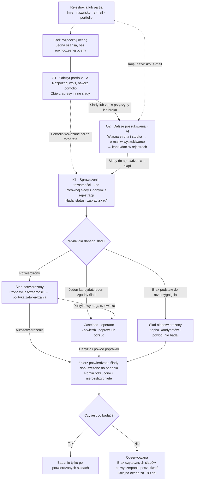
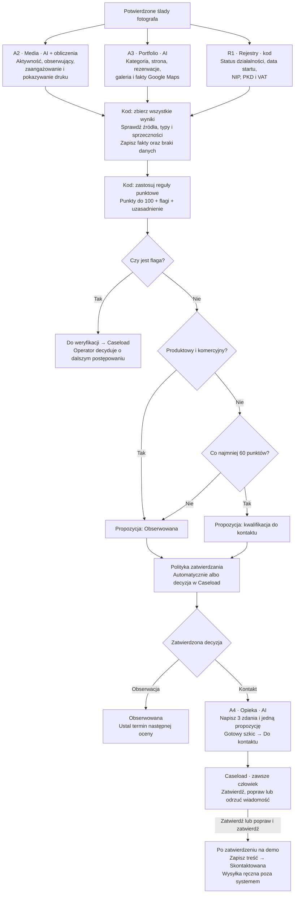

# Ocena fotografa: przepływ do rozmowy z zespołem

Propozycja po rozbiciu A1 na mniejsze zadania. Ten podział zastępuje wcześniejszy pomysł jednego agenta odkrycia. Reguły biznesowe pochodzą z [procesu oceny](proces-oceny.md); zmiany wymagające ustalenia z zespołem zebrano na końcu.

Open Mercato Agent Orchestrator prowadzi ocenę jednego fotografa. Uruchamia zadania, zbiera wyniki, zatrzymuje pracę przed wymaganą decyzją człowieka i wykonuje zatwierdzone zmiany. Odkrycie składa się z dwóch zadań dla agentów i osobnego kroku, który nadaje śladom status według reguł.

## 1. Od rejestracji do potwierdzonych śladów

Ślad to wszystko, co odkrycie znalazło o fotografie: konto społecznościowe, strona, galeria, wizytówka Google Maps, wpis w rejestrze, ale też miasto z opisu profilu czy NIP ze stopki. Każdy ślad ma status (potwierdzony / niepotwierdzony) i pole „skąd”.

Decyzje dotyczą poszczególnych śladów. Niepotwierdzony wpis CEIDG nie unieważnia potwierdzonego portfolio. Do badania może trafić sam profil społecznościowy, a fakty rejestrowe pozostaną nieznane. W tej propozycji ocena czeka na rozstrzygnięcie już utworzonych zadań Caseload, zanim zbierze końcowy zestaw śladów.

## 2. Od potwierdzonych śladów do decyzji o kontakcie

Odrzucenie propozycji pomija jej wykonanie. Nie oznacza automatycznej przegranej szansy. W gałęzi z flagą dalsze działanie zależy od decyzji operatora, dlatego diagram nie prowadzi z niej automatycznie do opieki. Każda poprawka z powodem staje się przypadkiem testowym.

## Co dokładnie robi każde zadanie

### O1. Odczyt portfolio

**Dostaje:** oryginalne portfolio, imię i nazwisko z rejestracji.

1. Rozpoznaje, czy wpis jest adresem strony, profilu, galerii, samą nazwą konta czy wpisem typu „brak”.
2. Otwiera podane miejsce. Samą nazwę konta sprawdza najpierw na Instagramie, potem na Facebooku.
3. Z dostępnego opisu zbiera nazwisko, miasto, e-mail kontaktowy, odsyłacz do własnej strony i ewentualny NIP.
4. Przy każdym ustaleniu zapisuje, gdzie je znalazł. Jeśli portfolio jest martwe, puste lub nie pozwala ustalić tożsamości, zapisuje powód i przekazuje pracę dalej.

**Oddaje:** rozpoznane portfolio, znalezione adresy i inne ślady ze źródłami. O1 nie przeszukuje rejestrów ani nie mierzy aktywności konta. Jego zadanie kończy się po odczycie wskazanego portfolio i zebraniu odsyłaczy do dalszego sprawdzenia.

### O2. Dalsze poszukiwania

**Dostaje:** imię, nazwisko, e-mail oraz wynik O1, także wtedy, gdy O1 nic nie znalazł.

1. Sprawdza własną stronę znalezioną w portfolio lub wynikającą z domeny e-maila. Domena publicznej poczty nie jest stroną fotografa.
2. Czyta kontakt, stopkę, regulamin i politykę prywatności. Szuka nazwiska, miasta, NIP-u oraz danych łączących stronę z fotografem.
3. Wyszukuje pełny e-mail w cudzysłowie. Trafienia w agregatorach zapisuje jako ślady niepotwierdzone.
4. Szuka kandydatów w rejestrach. Korzysta z wcześniejszych ustaleń, żeby zawęzić wyszukiwanie po nazwisku.

**Oddaje:** listę kandydatów z polem „skąd”. Nie wskazuje arbitralnie zwycięzcy spośród kilku osób o tym samym nazwisku. Nie zbiera jeszcze pełnego zestawu faktów do punktacji.

O2 ma ustaloną listę ścieżek, po której kończy poszukiwania. Budżet wywołań narzędzi i czas pracy wymagają ustalenia przez zespół. Awarię narzędzia zapisujemy osobno od wyniku „brak trafień”; ponowienia mają limit.

### K1. Sprawdzenie tożsamości

**Dostaje:** cztery dane z rejestracji i ślady z O1 oraz O2.

Sprawdza każdy ślad osobno według reguł z dokumentacji. Portfolio podane przez fotografa jest potwierdzone z definicji. Dla wpisu CEIDG lub VAT wymagana jest zgodność nazwiska i co najmniej jednego zgodnego śladu z innej ścieżki wskazanego w §6.4 procesu. Sam NIP z agregatora nie wystarcza. Kilka kopii tej samej informacji nie powinno być traktowane jako niezależne potwierdzenia.

**Oddaje:** status, pole „skąd” oraz propozycję tożsamości, jeśli są do niej podstawy. Brak rozstrzygnięcia pozostawia jako brak rozstrzygnięcia. Model może pomóc odczytać i uporządkować treść śladów; sprawdzenie wymaganych warunków należy do kodu. Nie proponujemy osobnego agenta, który sam ustala reguły pewności.

### A2, A3 i R1. Badanie równoległe

Każdy dostaje tylko potwierdzone ślady ze swojego zakresu oraz potrzebną historię wcześniejszej oceny.

| Zadanie | Co sprawdza | Co przekazuje dalej |
|---|---|---|
| A2 Media | Instagram i Facebook: liczby, daty, treść i zdjęcia ostatnich 12 postów; Pinterest: fakty z katalogu | Aktywność, obserwujących, sygnał druku. Kod liczy zaangażowanie i zmianę liczby obserwujących. |
| A3 Portfolio | Specjalizację z portfolio, stronę, rezerwacje, system galerii i potwierdzoną wizytówkę Google Maps | Kategorię oraz fakty o stronie, galerii i opiniach. Tylko A3 odpowiada za kategorię. |
| R1 Rejestry | Potwierdzone wpisy CEIDG/KRS i status VAT | Dane działalności ze źródłem i datą odczytu. Flagi i punkty wyprowadzi później kod. |

Portfolio na Instagramie może służyć A3 do ustalenia kategorii; pomiary tego konta należą do A2. Proponujemy współdzielić pobrany materiał w obrębie jednej oceny.

Brak danych zawsze oznacza „nieznane”. Jeśli nie ma potwierdzonego wpisu rejestrowego, R1 kończy z takim wynikiem. Nie rozpoczyna nowego szukania osoby. Nowy kandydat znaleziony podczas badania wraca do odkrycia, zanim stanie się źródłem faktów.

### Punktacja i wybór dalszej drogi

Kod czeka na zakończenie wszystkich części badania, także tych zakończonych niedostępnością źródła. Sprawdza wyniki, stosuje konfigurowalne reguły i zapisuje, za co przyznał punkty.

Kolejność warunków jest stała: najpierw flaga, potem kategoria produktowy i komercyjny, następnie próg 60 punktów. Nieznany fakt daje zero punktów i nie tworzy flagi. Przejście propozycji przez politykę zatwierdzania jest osobnym krokiem.

### A4. Przygotowanie wiadomości

**Dostaje:** zatwierdzoną kwalifikację do kontaktu, kategorię, system galerii i dozwolony kontekst portfolio. Imię i oryginalny e-mail z rejestracji wskazują adresata.

Pisze trzy zdania i jedną propozycję, np. próbkę lub test druku. Treść może nawiązywać do portfolio. Ustalenia o VAT, obserwujących i opiniach Google pozostają w wewnętrznym uzasadnieniu.

**Oddaje:** pełną wiadomość do Caseload. Wysokie ryzyko i proponowane `alwaysAsk: true` wymuszają decyzję człowieka. Agent nie wysyła wiadomości.

## Co zapisujemy i kiedy wracamy do fotografa

- Na fotografie: potwierdzone ślady i fakty wraz ze źródłami.
- Na jednej szansie: bieżące punkty, flagi, propozycję i etap.
- W aktywności oceny: datę, wynik, zmiany i uzasadnienie.
- Przy braku zmian: następna ocena po 14, 28, 56, 112, maksymalnie 180 dniach. Zmiana faktu przywraca 14 dni.
- Podczas oczekiwania na człowieka: w tej propozycji wstrzymujemy kolejną ocenę, także przy decyzji o tożsamości.
- Po pierwszym zamówieniu: wygrana; na demo oznaczana ręcznie. Przegrana wymaga decyzji człowieka z powodem. Zamknięta szansa nie jest dalej oceniana.

## Decyzje do przegadania z zespołem

1. **Granice poszukiwania.** Jaki czas i budżet narzędzi dajemy O2? Co robimy, gdy limit skończy się przed sprawdzeniem wszystkich ścieżek?
2. **Reguły tożsamości.** Dokumentacja dopuszcza zgodność nazwiska i jednego zgodnego śladu z innej ścieżki, w tym fotograficznego PKD. Czy to wystarcza przy popularnym nazwisku? Diagram zachowuje tę regułę; zespół powinien ją świadomie potwierdzić lub zaostrzyć.
3. **Punkty a pewność.** Proponujemy oddzielić potencjał fotografa od pewności poprawnego zastosowania reguł. W przeciwnym razie niski wynik może kierować zwykłą obserwację do Caseload.
4. **Znaczenie etapów.** Proponujemy ustawiać Do kontaktu dopiero po przygotowaniu wiadomości. Dla Do weryfikacji trzeba rozdzielić zapis stanu oczekiwania od propozycji dalszego działania, na którą czeka człowiek.
5. **Demo a faktyczny kontakt.** Na demo zatwierdzona wiadomość oznacza Skontaktowana, choć wysyłka jest ręczna. Docelowo proponujemy zmieniać etap po potwierdzeniu wysyłki.

Podział O1/O2/K1, współdzielenie pobranego materiału i opisane doprecyzowania są projektem zespołu, a nie gotowym przepływem dostarczanym przez Open Mercato. Potwierdzone mechanizmy platformy i źródła opisano w [dokumencie orkiestracji](orkiestracja-agentow.md#Weryfikacja-z-Open-Mercato).
