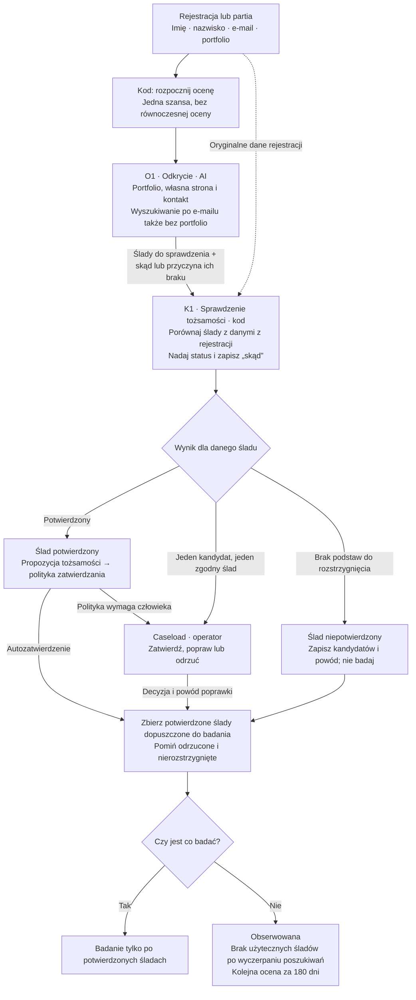
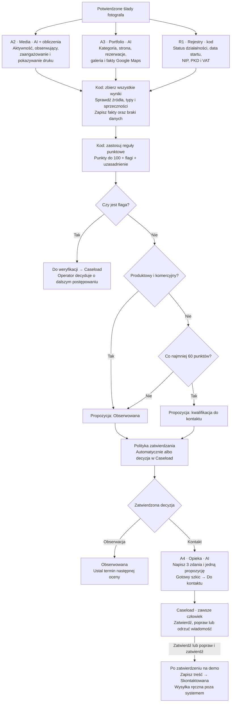

# Ocena fotografa: przepływ do rozmowy z zespołem

Decyzja z 19.09.2026: jeden agent odkrycia O1 zbiera ślady, a osobny krok K1 sprawdza ich przypisanie. Usuwamy osobnego agenta O2. Reguły biznesowe pochodzą z [procesu oceny](proces-oceny.md); zmiany wymagające ustalenia z zespołem zebrano na końcu.

Open Mercato Agent Orchestrator prowadzi ocenę jednego fotografa. Uruchamia zadania, zbiera wyniki, zatrzymuje pracę przed wymaganą decyzją człowieka i wykonuje zatwierdzone zmiany. Odkrycie wykonuje O1; K1 nadaje śladom status według reguł.

## 1. Od rejestracji do potwierdzonych śladów

Ślad to wszystko, co odkrycie znalazło o fotografie: konto społecznościowe, strona, galeria, wizytówka Google Maps, wpis w rejestrze, ale też miasto z opisu profilu czy NIP ze stopki. Każdy ślad ma status (potwierdzony / niepotwierdzony) i pole „skąd”.

Decyzje dotyczą poszczególnych śladów. Niepotwierdzony wpis CEIDG nie unieważnia potwierdzonego portfolio. Do badania może trafić sam profil społecznościowy, a fakty rejestrowe pozostaną nieznane. W tej propozycji ocena czeka na rozstrzygnięcie już utworzonych zadań Caseload, zanim zbierze końcowy zestaw śladów.

## 2. Od potwierdzonych śladów do decyzji o kontakcie

Odrzucenie propozycji pomija jej wykonanie. Nie oznacza automatycznej przegranej szansy. W gałęzi z flagą dalsze działanie zależy od decyzji operatora, dlatego diagram nie prowadzi z niej automatycznie do opieki. Każda poprawka z powodem staje się przypadkiem testowym.

## Co dokładnie robi każde zadanie

### O1. Odkrycie

**Dostaje:** oryginalne portfolio, e-mail, imię i nazwisko z rejestracji.

1. Rozpoznaje adres strony, profilu, galerii, nazwę konta lub wpis typu „brak”. Pierwsze wyszukiwanie wykonuje po pełnym e-mailu w cudzysłowie; następnie odczytuje dostępne portfolio i zbiera odsyłacze.
2. Sprawdza znalezioną własną stronę oraz kontakt, stopkę, informacje o autorze i informacje prawne. Szuka nazwiska, miasta, NIP-u i powiązań z fotografem.
3. Sprawdza kandydatów znalezionych po e-mailu oraz uzupełnia brakujące ślady przez nazwisko, markę lub własną domenę. Robi to również przy pustym albo martwym portfolio. Domena publicznej poczty nie jest stroną fotografa.
4. Zwraca stronę, kontakt, Instagram, Facebook, Google Maps, kandydatów NIP i miasto wraz ze źródłami, oceną pewności i zakresem wykonanych poszukiwań. Nie wymyśla adresów ani nie wybiera arbitralnie osoby o tym samym nazwisku.

**Oddaje:** jeden wynik `research` dla K1. Ocena pewności modelu nie zastępuje decyzji K1 ani wymaganej decyzji człowieka. O1 nie mierzy aktywności, nie punktuje i nie odpytuje rejestrów. Wyszukiwanie kandydatów w rejestrach pozostaje przyszłym, niewdrożonym rozszerzeniem; nie jest ukrytym zadaniem usuniętego O2.

O1 ma wspólny budżet: 10 wyszukiwań, 15 odczytów stron, głębokość dwa i pięć minut, z jednym ponowieniem błędu przejściowego w tych samych limitach. Awarię narzędzia i wyczerpanie budżetu zapisuje osobno od zakończonych poszukiwań bez trafień. Brak portfolio sam w sobie nie kończy odkrycia.

### K1. Sprawdzenie tożsamości

**Dostaje:** cztery dane z rejestracji i wynik O1.

Sprawdza każdy ślad osobno według reguł z dokumentacji. Portfolio podane przez fotografa jest potwierdzone z definicji. Dla wpisu CEIDG lub VAT wymagana jest zgodność nazwiska i co najmniej jednego zgodnego śladu z innej ścieżki wskazanego w §6.4 procesu. Sam NIP z agregatora nie wystarcza. Kilka kopii tej samej informacji nie powinno być traktowane jako niezależne potwierdzenia.

**Oddaje:** status, pole „skąd” oraz propozycję tożsamości, jeśli są do niej podstawy. Brak rozstrzygnięcia pozostawia jako brak rozstrzygnięcia. Model może pomóc odczytać i uporządkować treść śladów; sprawdzenie wymaganych warunków należy do kodu. Nie proponujemy osobnego agenta, który sam ustala reguły pewności.

### A2, A3 i R1. Badanie równoległe

Każdy dostaje tylko potwierdzone ślady ze swojego zakresu oraz potrzebną historię wcześniejszej oceny.

| Zadanie | Co sprawdza | Co przekazuje dalej |
|---|---|---|
| A2 Media | Instagram i Facebook: liczby, daty, treść i zdjęcia ostatnich 12 postów; Pinterest: fakty z katalogu | Aktywność, obserwujących, sygnał druku. Kod liczy zaangażowanie i zmianę liczby obserwujących. |
| A3 Portfolio | Specjalizację z portfolio, stronę, rezerwacje, system galerii i potwierdzoną wizytówkę Google Maps | Kategorię oraz fakty o stronie, galerii i opiniach. Tylko A3 odpowiada za kategorię. |
| R1 Rejestry | Potwierdzone wpisy CEIDG/KRS i status VAT | Dane działalności ze źródłem i datą odczytu. Flagi i punkty wyprowadzi później kod. |

Portfolio na Instagramie może służyć A3 do ustalenia kategorii; pomiary tego konta należą do A2. Proponujemy współdzielić pobrany materiał w obrębie jednej oceny.

Brak danych zawsze oznacza „nieznane”. Jeśli nie ma potwierdzonego wpisu rejestrowego, R1 kończy z takim wynikiem. Nie rozpoczyna nowego szukania osoby. Nowy kandydat znaleziony podczas badania wraca do odkrycia, zanim stanie się źródłem faktów.

### Punktacja i wybór dalszej drogi

Kod czeka na zakończenie wszystkich części badania, także tych zakończonych niedostępnością źródła. Sprawdza wyniki, stosuje konfigurowalne reguły i zapisuje, za co przyznał punkty.

Kolejność warunków jest stała: najpierw flaga, potem kategoria produktowy i komercyjny, następnie próg 60 punktów. Nieznany fakt daje zero punktów i nie tworzy flagi. Przejście propozycji przez politykę zatwierdzania jest osobnym krokiem.

### A4. Przygotowanie wiadomości

**Dostaje:** zatwierdzoną kwalifikację do kontaktu, kategorię, system galerii i dozwolony kontekst portfolio. Imię i oryginalny e-mail z rejestracji wskazują adresata.

Pisze trzy zdania i jedną propozycję, np. próbkę lub test druku. Treść może nawiązywać do portfolio. Ustalenia o VAT, obserwujących i opiniach Google pozostają w wewnętrznym uzasadnieniu.

**Oddaje:** pełną wiadomość do Caseload. Wysokie ryzyko i proponowane `alwaysAsk: true` wymuszają decyzję człowieka. Agent nie wysyła wiadomości.

## Co zapisujemy i kiedy wracamy do fotografa

- Na fotografie: potwierdzone ślady i fakty wraz ze źródłami.
- Na jednej szansie: bieżące punkty, flagi, propozycję i etap.
- W aktywności oceny: datę, wynik, zmiany i uzasadnienie.
- Przy braku zmian: następna ocena po 14, 28, 56, 112, maksymalnie 180 dniach. Zmiana faktu przywraca 14 dni.
- Podczas oczekiwania na człowieka: w tej propozycji wstrzymujemy kolejną ocenę, także przy decyzji o tożsamości.
- Po pierwszym zamówieniu: wygrana; na demo oznaczana ręcznie. Przegrana wymaga decyzji człowieka z powodem. Zamknięta szansa nie jest dalej oceniana.

## Decyzje do przegadania z zespołem

1. **Granice poszukiwania.** O1 ma opisane wyżej limity. Jak proces ma obsłużyć niepełny wynik po ich wyczerpaniu, zanim wdrożymy pełną ocenę?
2. **Reguły tożsamości.** Dokumentacja dopuszcza zgodność nazwiska i jednego zgodnego śladu z innej ścieżki, w tym fotograficznego PKD. Czy to wystarcza przy popularnym nazwisku? Diagram zachowuje tę regułę; zespół powinien ją świadomie potwierdzić lub zaostrzyć.
3. **Punkty a pewność.** Proponujemy oddzielić potencjał fotografa od pewności poprawnego zastosowania reguł. W przeciwnym razie niski wynik może kierować zwykłą obserwację do Caseload.
4. **Znaczenie etapów.** Proponujemy ustawiać Do kontaktu dopiero po przygotowaniu wiadomości. Dla Do weryfikacji trzeba rozdzielić zapis stanu oczekiwania od propozycji dalszego działania, na którą czeka człowiek.
5. **Demo a faktyczny kontakt.** Na demo zatwierdzona wiadomość oznacza Skontaktowana, choć wysyłka jest ręczna. Docelowo proponujemy zmieniać etap po potwierdzeniu wysyłki.

Podział O1/K1, współdzielenie pobranego materiału i opisane doprecyzowania są projektem zespołu, a nie gotowym przepływem dostarczanym przez Open Mercato. Potwierdzone mechanizmy platformy i źródła opisano w [dokumencie orkiestracji](orkiestracja-agentow.md#Weryfikacja-z-Open-Mercato).
